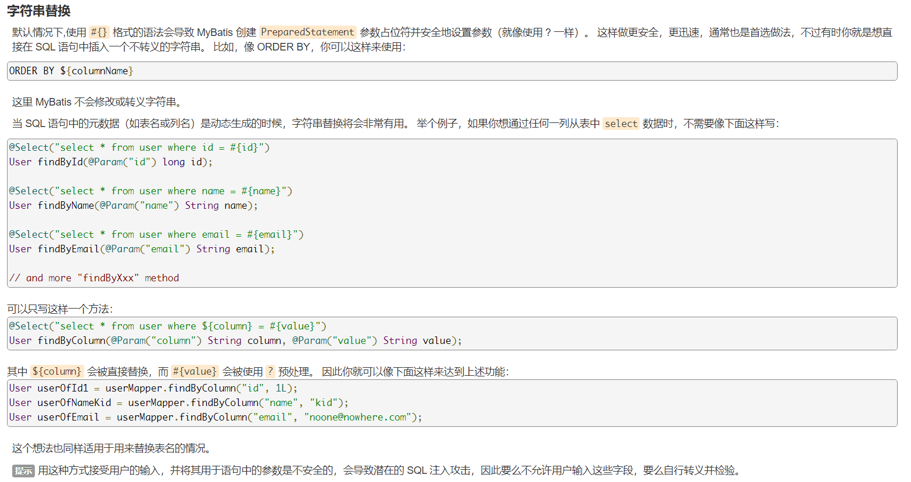

1. [SpringBoot - zed058.cn](https://zed058.cn/code/dev/springboot-00%E8%AF%BE%E5%89%8D%E5%87%86%E5%A4%87.html)
2. [SpringBoot(zed058) - bilibili](https://www.bilibili.com/video/av39775932?zw)
3. [SpringBoot项目开发(六)：Mybatis持久层框架](https://blog.csdn.net/zhuyu19911016520/article/details/81190948)
4. [spring boot(7)-mybatis全注解化](https://blog.csdn.net/wangb_java/article/details/72974473)
5. [在cmd命令行下执行mvn -v命令后报错](https://www.jianshu.com/p/926b1c34e7a5)
6. [mybatis使用注解方式插入数据后获取自增长的主键值](https://blog.csdn.net/Agly_Clarlie/article/details/78195677)
7. [Lombok 看这篇就够了](https://zhuanlan.zhihu.com/p/32779910)
8. [错误解决java.sql.SQLException: The server time zone value 'Öйú±ê׼ʱ¼ä' is unrecognized](https://blog.csdn.net/qq_39098813/article/details/81138648)
9. [XML 映射文件](https://mybatis.org/mybatis-3/zh/sqlmap-xml.html)
10. [Spring Boot中使用MyBatis注解配置详解](http://blog.didispace.com/mybatisinfo/)
11. [@One和@Many的例子](https://blog.csdn.net/wfq784967698/article/details/78786001)

12. [Java 实例 - Enum（枚举）构造函数及方法的使用](https://www.runoob.com/java/method-enum1.html)
13. [springboot自定义http反馈状态码](https://www.cnblogs.com/fnlingnzb-learner/p/10685651.html)
14. [@RequestBody - Map/Object](https://www.jianshu.com/p/4981911d5e15)
15. [@RequestBody JSON parameters解析](https://www.runoob.com/w3cnote/fastjson-intro.html)
16. [Java日期类：Date和Calendar的使用](https://www.cnblogs.com/buwuliao/p/9810338.html)
17. [mybatis 异常 使用@Param](https://blog.csdn.net/jeffleo/article/details/55803548)
18. [Mybatis 数据库操作的返回值](https://blog.csdn.net/gaojinshan/article/details/24308313)

- `@Controller`：该注解用于类上，其表明该类是 Spring MVC 的 Controller；
- `@RestController`:该注解是一个组合注解，只能用于类上，其作用与 @Controller、@ResponseBody一起用于类上等价。
- `@RequestMapping`：该注解主要用来映射 Web 请求，其可以用于类或者方法上；
- `@RequestParam`：该注解主要用于将请求参数数据映射到功能处理方法的参数上；
- `@ResponseBody`：该注解的作用是将方法的返回值放在 Response 中，而不是返回一个页面，其可以用于方法上或者方法返回值前；
- `@RequestBody`：用于读取 HTTP 请求的内容（字符串），通过 Spring MVC 提供的 HttpMessageConverter 接口将读到的内容转换为 JSON、XML 等格式的数据并绑定到 Controller 方法的参数上；
- `@PathVariable`：用于接收请求路径参数，将其绑定到方法参数上；

