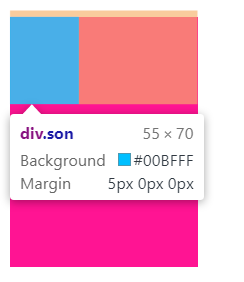
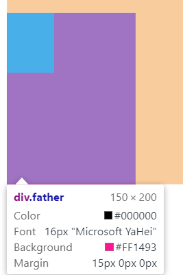
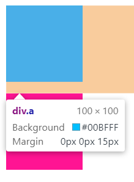
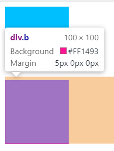
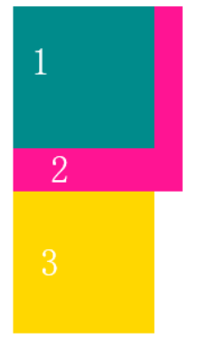

## 1. 多类名

- 可以把一些标签元素共同的样式放到一个类中
- 标签调用公共的类，再调用自己独有的类
- 各个类名中间用空格隔开

```html
<!DOCTYPE html>
<html>
<head>
    <style>
        .class-a { ... }
        .class-b { ... }
    </style>
</head>
<body>
    <div class='class-a class-b'> ... </div>
</body>
</html>
```

## 2. 字体的粗细

- 一些字体只提供 `normal` 和 `bold` 两种值
- `lighter`：比从父元素继承来的值更细(处在字体可行的粗细值范围内)
- `bolder`：比从父元素继承来的值更粗(处在字体可行的粗细值范围内)
- `<number>`
  - 非 100 的整数倍的值将被四舍五入转换为 100 的整倍数
  - **无需单位**

## 3. 过渡 Transition

```css
transition: property duration timing-function delay 
```

- 属性`transition-property`
  - 需要变化的属性
  - 例如：width，height
  - 需要**所有**属性变化，简写为：`all`
- 持续时间`transition-duration`
  - 单位：s，必填
  - 例如：`.5s`
- 运动曲线`transition-timing-function` *可省略*
  - linear：匀速
  - ease：逐渐慢下来
  - ease-in：加速
  - ease-out：减速
  - ease-in-out：先加速后减速
- 延时`transition-delay` *可省略*
  - 单位：s
  - 可以设置延迟的触发时间

```css
.t {
    width: 200px;
    height: 100px;
    background-color: aqua;
    transition: all .5s ease .3s;
}

.t:hover {
    width: 400px;
    height: 200px;
    background-color: blue;
}
```

## 4. 复合选择器

- 后代选择器

  - 外层标签在前，内层标签在后
  - **所有**的后代

  ```html
  <!DOCTYPE html>
  <html lang="en">
  <head>
  	<meta charset="UTF-8">
  	<title>Document</title>
      <style>
          .father a { ... }
      </style>
  </head>
  <body>
  	<div class="father">
  		<div class="son">
  			<a href="" class="grandson"></a>
  		</div>
  		<a href="" class="son"></a>
  	</div>
  </body>
  </html>
  ```

- 子选择器 `>`

  - 只能选择元素**最近一级**的子元素
  - 不会选到所有的后代

  ```css
  .father > a { ... }
  ```

- 并集选择器 `,`

  ```css
  div, span { ... }
  ```

- 伪类选择器

  声明的**顺序**不能颠倒

  ```css
  // 链接伪类选择器
  a:link { ... }
  a:visited { ... }
  a:hover { ... }
  a:active { ... }
  ```

- focus选择器

  主要针对`<input/>`组件

  ```css
  input:focus { ... }
  ```
  
- [相邻兄弟选择器](https://developer.mozilla.org/zh-CN/docs/Web/CSS/Adjacent_sibling_combinator)`+`

  当第二个元素紧跟在第一个元素之后，并且两个元素都是属于<u>同一个父元素</u>的子元素，则`第二个元素`将被选中。

- [通用兄弟选择器](https://developer.mozilla.org/zh-CN/docs/Web/CSS/General_sibling_combinator)`~`

  位置无须紧邻，只须同层级，`A~B` 选择`A`元素之后**所有**同层级`B`元素。

## 5. 元素的显示模式 display

- 块级元素`{display: block}`
  - 独占一行
  - 有 height，width，margin，padding 属性
  - 宽度默认是**父级**元素的`100%`
- 行内元素`{display: inline}`
  - 相邻的行内元素在一行上，一行可显示多个
  - **没有** height，width 属性
  - 有**左右**的 margin、padding
  - 默认宽度为内容的宽度
- 只能容纳文本/行内元素
  
- 行内块元素`{display: inline-block}`
  - 例如：\，\<input/>，\<td/>
  - 相邻的行内块元素在一行上
  - 默认宽度为本身内容的宽度
  - 有 **height**，**width**，margin，padding 属性

## 6. 单行文字垂直居中

```css
// 文字的行高 = 盒子的高度
// 文字的行高 = 上空隙 + 文字高度 + 下空隙
div {
    height: 40px;
    line-height: 40px;
}
```

## 7. 背景 background

- 颜色`backgroud-color`：<u>transparent</u>，*color*

- 图片`background-image`：<u>none</u>，url(<i style="color:green">url</i>)

- 平铺`background-repeat`：<u>repeat</u>，no-repeat，repeat-x，repeat-y

- 固定`backgroud-attachment`：<u>scroll</u>，fixed（*可制作视差滚动效果*）

- 大小`background-size`：[参考 - MDN](https://developer.mozilla.org/zh-CN/docs/Web/CSS/background-size)

- **位置**`background-position`：（x，y）

  - 方位：top，center，bottom，left，right

    ```css
    /* 
     * 盒子靠上，居中的位置 
     */
    backgroup-position: center top;
    ```

  - 精确单位：百分数|带单位的长度值

  - 如果只指定x，则y默认为`center`

  - 方位和单位可以混合使用

## 8. 图片整合 Sprites

- 又称，雪碧图、精灵图
- 需要的图片整合成一张大图，**减少**HTTP的请求次数
- 通过`backgroud-position`移动需要的图片的位置

## 9. CSS三大特性

- 层叠性：就近原则
- 继承性
- 优先级 *由低到高*
  - 继承 / *
  - 元素选择器
  - 类选择器，伪类选择器
  - ID选择器
  - 行内样式
  - `!important`

## 10. padding撑开盒子

- 如果指定了width/height时，也指定了padding，盒子的实际宽高会被padding撑大
- 不指定width/height，直接指定padding，盒子的宽高不会被padding撑大

## 11. 元素水平居中

### 块级元素

- 一定要指定**宽度**
- 左右的外边距为`auto`

```css
width: 200px
margin: 20px auto
```

### 行内元素和行内块元素

- 给其父元素添加

```css
text-align: center
```

## 12. 外边距重叠

- [外边距重叠 - MDN](https://developer.mozilla.org/zh-CN/docs/Web/CSS/CSS_Box_Model/Mastering_margin_collapsing)

- **块级**元素的**垂直**方向的`margin`会触发
- 边界折叠，只会挑选**最大**边界范围留下

### 没有内容将父元素和后代元素分开

```html
<body>
    <div class="father">
        <div class="son"></div>
    </div>
</body>
```

```css
.father {
    background-color: deeppink;
    height: 200px;
    width: 150px;
    margin-top: 15px;
}

.son {
    background-color: deepskyblue;
    height: 70px;
    width: 55px;
    margin-top: 5px;
}
```





- 解决方式
  - 父元素定义边框
  - 父元素指定padding
  - 父元素添加属性：`overflow: hidden`

### 同一层相邻元素之间

```html
<body>
    <div class="a"></div>
    <div class="b"></div>
</body>
```

```css
div {
    width: 100px;
    height: 100px;
}

.a {
    background-color: deepskyblue;
    margin-bottom: 15px;
}

.b {
    background-color: deeppink;
    margin-top: 5px;
}
```

实际结果不会是15px + 5px，而是取两者中的较大值：15px





## 13. 圆角边框

- border-radius: length / 左上，右上，右下，左下

- 画圆形

  ```css
  /* 半径为盒子宽高的一半 */
  width: 50px;
  height: 50px;
  border-radius: 50%; 
  ```

- 画椭圆

  ```css
  width: 50px;
  height: 70px;
  boder-radius: 50%;
  ```

## 14. 盒子阴影

- box-shadow: <u>x</u>，<u>y</u>，blur，spread，color，*inset*
  - x，y：阴影的水平➡、垂直⬇距离，允许负值
  - blur：阴影的虚实程度，0px => 实心阴影
  - spread：阴影的缩放程度，负值为阴影小于盒子尺寸
  - color：阴影颜色
  - inset：默认不写为外阴影`outset`

- 阴影不占空间
- 可以由`逗号`分隔的列表来描述一个或**多个**阴影效果

```css
/* 新拟物风格Neumorphism */
box-shadow: 
	18px 18px 30px rgba(0,0,0,0.1),
	-18px -18px 30px rgba(255,255,255,1)
```

## 15. 传统布局方式

- 文档流
- 浮动
- 定位

## 16. 浮动 Float

- 典型应用：多个块级元素一行内排列，无需使用`inline-block`
- `float`属性用于创建`浮动框`，将其移动到一边，直到左边缘或右边缘<u>触及</u>**包含块**或另一个浮动框的边缘
  - float：<u>none</u>，left，right
- 浮动的特性
  - 浮动元素会<u>脱离</u>标准文档流，`不再保留`<u>原先的位置</u>，原先的位置被其他的文档流元素占据
  - 浮动元素会`一行内`显示，并且元素**顶部对齐**，父元素宽度不够，会另起一行
  - 浮动元素会具有`行内块元素`的特性
  - 浮动的盒子只会影响其**后**的标准流，<u>不会影响其前面的</u>

```html
<body>
    <div class="kk1"></div>
    <div class="kk2"></div>
    <div class="kk3"></div>
</body>
```

```css
div {
    width: 100px;
    height: 100px;
}

.kk1 {
    background-color: darkcyan;
    float: left;
}

.kk2 {
    background-color: deeppink;
    width: 120px;
    height: 130px;
}

.kk3 {
    background-color: gold;
    float: left;
}
```



## 17. 清除浮动

### 引例

> 很多场景下，父级包裹元素需要动态的变化高度。
>
> 在父级元素（标准文本流）<u>未指定高度时</u>，成为浮动盒子的两个子元素，因为脱离了标准文本流不再具有位置，所以无法将父级包裹元素的高度撑开。
>
> 此时，父级包裹元素的高度为0，又会影响下面的标准流元素。

```html
<body>
    <div class="father">
        <div class="son1"></div>
        <div class="son2"></div>
    </div>
</body>
```

```css
.father {
    width: 800px;
    border: 1px solid gold;
}

.son1 {
    float: left;
    width: 300px;
    height: 200px;
    background-color: peru;
}

.son2 {
    float: left;
    width: 200px;
    height: 300px;
    background-color: deeppink;
}
```

### 解决

- 清除浮动后，父级元素就会根据浮动的子元素自动检测高度，父级元素高度正常，就不会影响之后的标准流

### 额外空标签标签使用clear

- `clear属性`指定一个元素是否必须移动(清除浮动后)到在它之前的浮动元素下面

  <u>none</u>，left，right，both

- clear属性只能用在**块级元素**

```html
<body>
    <div class="father">
        <div class="son1"></div>
        <div class="son2"></div>
        <div class="clear"></div>
    </div>
</body>
```

```css
.father {
    width: 800px;
    border: 1px solid gold;
}

.son1 {
    float: left;
    width: 300px;
    height: 200px;
    background-color: peru;
}

.son2 {
    float: left;
    width: 200px;
    height: 300px;
    background-color: deeppink;
}

.clear {
    clear: both;
}
```

### after伪元素清除浮动

```css
.father {
    content: "";
    display: block;
    height: 0;
    clear: both;
    visibility: hidden;
}
```

### 双伪元素清除浮动

```css
.father:before,
.father:after {
    content: "";
    display: table;
}
.father:after {
    clear: both;
}
```

### 父级元素添加overflow属性

```css
.father {
    overflow: hidden;
}
```

## 18. 定位 position

### 定位模式

- 静态定位`static`
- 相对定位`relative`
- 绝对定位`absolute`
- 固定定位`fixed`
- 粘性定位`sticky`

### 边偏移

- top，bottom，left，right

### 特殊特性

- `行内元素`添加绝对/固定定位，可以直接设置 width，height
- `块级元素`添加绝对/固定定位，不设置宽高，默认大小为内容的大小

### 静态定位 static

- 元素的`默认`定位方式，可理解为**无定位**

- 按照标准文档流，<u>无法使用</u>边偏移

### 相对定位 relative

- 元素使用边偏移移动位置时，**相对**其`原来的位置`（文档流中的位置）而言
- 文档流的位置会被`保留`，效果与浮动不同
- 不参照其父元素，也不参照屏幕
- 典型应用：作为绝对定位的父元素（不设置位偏移，只设置模式为relative）

### 绝对定位 absolute

- 相对于**最近**的`非static`定位祖先元素的偏移

- 当这样的祖先元素不存在时，则相对于<u>初始包含块</u>`inital container block`

- 元素会**被移出**正常文档流，原来的位置**不再保留**

- 由于脱离文档流，flex container中的`绝对定位元素`不参与flex layout

- 绝对定位的元素可以设置外边距`margin`，且不会与其他边距合并

  ```css
  /* 实现绝对定位时的水平居中 */
  .father {
      width: 300px;
      height: 300px;
      background-color: deeppink;
      position: relative;
  }
  
  .son {
      position: absolute;
      width: 100px;
      height: 100px;
      background-color: fuchsia;
      left: 0;
      right: 0;
      bottom: 10px;
      margin: 0px auto;
  }
  /* 
   * 方法二
   * transform 里的 translate 偏移的百分比值是相对于自身大小的
   * 方法一在微信小程序中无法生效
   */
  .son {
      position: absolute;
      bottom: 55%;
      left: 50%;
      transform: translate(-50%, 0%);
  }
  ```

### 固定定位 fixed

- 相对于`viewport视口`（浏览器的可视窗口）偏移
- 不随滚动条而滚动
- 元素会**被移出**正常文档流，原来的位置**不再保留**

### 粘性定位 sticky

- 粘性定位可以被认为是相对定位和固定定位的混合
- 元素在跨越`特定阈值`**前**为<u>相对定位</u>，**之后**为<u>固定定位</u>

- **必须**指定 top，right，bottom，left 四个阈值其中之一，才可使粘性定位生效，否则其行为与相对定位相同

### 与浮动的比较

- 浮动会在文档流的盒子之上，但<u>不会覆盖</u>其中的`文字`/图片

- 绝对定位/固定定位会覆盖文档流的盒子的所有内容

## 19. 元素的隐藏

### display 属性

- `display: none;`：隐藏元素

- 元素被隐藏后，**不再占有**原来的位置

### visibility 属性

- visibility：<u>inherit</u>，visible，collapse，hidden
- 元素被隐藏后，**继续占有**原来的位置

### overflow 属性

- 定义当一个元素的内容太大而无法适应`块级格式化上下文`时候该做什么
- overflow：<u>visible</u>，auto，hidden，scroll
- 如果有定位的盒子，慎用`overflow: hidden`

## 20. 字体图标 IconFont

- [参考视频](https://www.bilibili.com/video/BV14J4114768?p=257)
- 本质是字体
- 支持兼容性，不同的字体格式
  - `.ttf`
  - `.woff`
  - `.eot`
  - `.svg`

## 21. CSS画三角形

```css
.box {
    width: 0;
    heigth: 0;
    border: 10px solid transparent;
    border-top-color: deeppink;
}
```

## 22. 垂直对齐 vertical-align

- 指定行内元素`inline`，行内块元素`inline-block`，表格单元格元素`table-cell`的垂直对齐方式

- 对块级元素不起作用
- [参考视频](https://www.bilibili.com/video/BV14J4114768?p=263)
- [vertical-align - MDN](https://developer.mozilla.org/zh-CN/docs/Web/CSS/vertical-align)