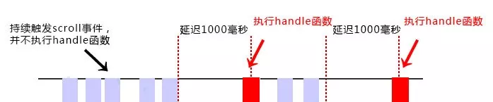
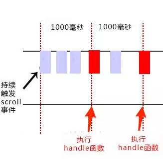

1. [手写函数防抖和节流](https://www.bilibili.com/video/BV1pQ4y1M71e)
2. [JS的防抖与节流](https://mp.weixin.qq.com/s/Vkshf-nEDwo2ODUJhxgzVA)

## 防抖 Debounce

- 当续触发事件时，一定时间段内没有再触发事件，事件处理函数才会执行一次
- 如果设定的时间到来之前，又一次触发了事件，就重新开始延时



### 简单的防抖实现

```javascript
function debounce(fn, wait) {
    let timeout = null
    return function () {
        let context = this
        let args = arguments
        // 如果已有在计时中的计时器，则将此定时器清空
        if (timeout !== null)
            clearTimeout(timeout)
        // 每次触发事件都新创建一个定时器，直到定时器结束才调用回调，实现防抖的效果
        timeout = setTimeout(function () {
            fn.apply(context, args)
        }, wait)
    }
}
// 处理函数
function handle() {
    console.log(Math.random())
}
// 滚动事件
let container = document.querySelector('#container')
container.addEventListener('scroll', debounce(handle, 1000))
```

- 闭包的 timeout 变量用于保存当前`在计时的定时器`的ID，以便下一次触发事件时能够先停止`在计时的定时器`
- 返回的闭包函数中的 context 用于保存调用防抖函数的对象的 this 指针
- 返回的闭包函数中的 args 用于保存传给高阶函数 debounce，但是是要给 handle 函数使用的参数

### 带第三个参数和取消功能的完整防抖实现

- 传参`immediate`为 true，debounce 会在`wait`时间间隔的开始调用这个函数
- 并且<u>保证</u>在**最后一次事件**触发后的`wait`时间之内，不会再次调用

```javascript
function debounce(func, wait, immediate) {
    let timeout
    return function () {
        let context = this
        let args = arguments

        if (timeout) clearTimeout(timeout)

        if (immediate) {
            let callNow = !timeout
            timeout = setTimeout(() => {
                timeout = null
            }, wait)
            if (callNow) {
                func.apply(context, args)
            }
        } else {
            timeout = setTimeout(() => {
                func.apply(context, args)
            }, wait)
        }
    }
}
```

## 节流 Throttle

- 当持续触发事件时，保证一定时间段内只调用一次事件处理函数



> [与函数有关的函数 - underscore.js](https://www.underscore-js.com/functionsRelated.html)
>
> 默认情况下，throttle 将在调用的第一时间尽快执行这个 function
> 并且，如果在wait周期内调用任意次数的函数，都将尽快的被覆盖
> 如果你想禁用第一次首先执行的话，传递 {leading: false}
> 如果你想禁用最后一次执行的话，传递 {trailing: false}
> 但是 leading 和 trailing 不能同时为 false，否则会在underscore中出现bug

### 简易版 - 时间戳实现

```javascript
// leading: true, trailing: false
const throttle = function (func, delay) {
    let prev = 0	// 保证第一次一定能执行
    return function () {
        let context = this	// 指向执行函数的对象
        let args = arguments
        let now = Date.now()
        if (now - prev >= delay) {
            // 上一次触发事件的时刻与此次将要触发的事件的时刻，相距时间超过规定的delay，才会执行回调
            func.apply(context, args)
            prev = Date.now()
        }
    }
}
function handle() {
    console.log(Math.random())
}
window.addEventListener('scroll', throttle(handle, 1000))
```

### 简易版 - 定时器实现

```javascript
// leading: false, trailing: true
const throttle = function (func, delay) {
    let timer = null
    return function () {
        let context = this
        let args = arguments
        if (!timer) {   // 如果已有在计时的计时器，则不操作，等待当前的计时器结束
            timer = setTimeout(function () {
                func.apply(context, args)   // 计时器结束时调用回调函数
                timer = null
            }, delay)
        }
    }
}
function handle() {
    console.log(Math.random())
}
window.addEventListener('scroll', throttle(handle, 1000))
```

### 完整版本

```javascript
// leading: true, trailing: true
function throttle(func, wait) {
    let context, args, timeout
    let previous = 0     // 保证第一次一定执行
    const later = () => {
        previous = new Date.now()
        timeout = null
        func.apply(context, args)
    }
    return function () {
        context = this
        args = arguments
        let now = new Date.now()
        if (now - previous > wait) {
            if (timeout) {
                clearTimeout(timeout)
                timeout = null
            }
            func.apply(context, args)
            previous = now
        } else if (!timeout) {
            timeout = setTimeout(later, wait)
        }
    }
}
```

