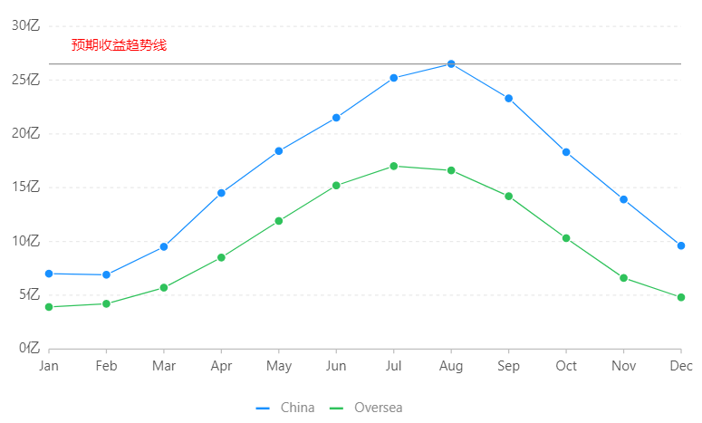

1. [官方文档](https://bizcharts.net/index)
2. [Example - 掘金](https://juejin.im/post/5c0f45edf265da61327f285c#comment)

### \<Chart>

- \<Chart>中的组件声明顺序类似于Konva中，Layer里添加的多个Shape，最先添加的在最下面，后面添加的在上面
- [scale](https://bizcharts.net/products/bizCharts/api/scale) 属性：max, min 字段限制了显示的数据

### 各类型几何标记对应支持的shape

| geom类型 | shape类型                                                    | 解释                                                         |
| :------: | ------------------------------------------------------------ | ------------------------------------------------------------ |
|  point   | 'circle','square','bowtie',<br/>'diamond','hexagon','triangle',<br/>'triangle-down','hollowCircle',<br/>'hollowSquare','hollowBowtie',<br/>'hollowDiamond','hollowHexagon',<br/>'hollowTriangle','hollowTriangle-down',<br/>'cross','tick','plus',<br/>'hyphen','line' | hollow开头的图形都是空心的                                   |
|   line   | 'line','smooth','dot','dash',<br/>'dotSmooth','spline'       | dot ：点线<br/>smooth： 平滑线                               |
|   area   | 'area','smooth','line',<br/>'dotLine','smoothLine','dotSmoothLine' | [area]和[smooth]是填充内容的区域图，其他图表是空心的线图     |
| interval | 'rect','hollowRect','line',<br/>'tick','stroke'              | [hollowRect]是空心的矩形， [line]和 [tick] 都是线段,stroke：带边框的矩形 |
| polygon  | 'polygon','hollow','stroke'                                  | polygon：多边形、hollow：空心多边形和 stroke：带边框的多边形 |
|  schema  | 'box','candle'                                               | 目前仅支持箱须图、K线图                                      |

### 修改Tooltip的样式

- \<Geom>的 [tooltip](https://bizcharts.net/products/bizCharts/api/geom#tooltip) 属性
- \<Tooltip>的 [itemTpl](https://bizcharts.net/products/bizCharts/api/tooltip#itemtpl) , [containTpl](https://bizcharts.net/products/bizCharts/api/tooltip#containertpl) 属性

- Example

```jsx
const data = [
    { x: 'Oceania', low: 1, q1: 9, median: 16, q3: 22, high: 24 },
    { x: 'East	Europe', low: 1, q1: 5, median: 8, q3: 12, high: 16 },
    { x: 'Australia', low: 1, q1: 8, median: 12, q3: 19, high: 26 },
    { x: 'South America', low: 2, q1: 8, median: 12, q3: 21, high: 28 },
    { x: 'North Africa', low: 1, q1: 8, median: 14, q3: 18, high: 24 },
    { x: 'North America', low: 3, q1: 10, median: 17, q3: 28, high: 30 },
    { x: 'West	Europe', low: 1, q1: 7, median: 10, q3: 17, high: 22 },
    { x: 'West	Africa', low: 1, q1: 6, median: 8, q3: 13, high: 16 }
]
const dv = new DataView().source(data)
dv.transform({
    type: 'map',
    callback: (obj) => {
        obj.range = [obj.low, obj.q1, obj.median, obj.q3, obj.high]
        return obj
    }
})
const cols = {
    range: {
        max: 35
    }
}
const itemTPL =
  '<li data-tndex={tndex} style="margtn-bottom:4px;">'
  + '<span style="background-color:{color};" class="g2-toolttp-marker"></span>'
  + '{name}<br/>'
  + '<span style="padding-left:16px">最大值：{high}</span><br/>'
  + '<span style="padding-left:16px">上四分位数：{q3}</span><br/>'
  + '<span style="padding-left:16px">中位数： {median}</span><br/>'
  + '<span style="padding-left:16px">下四分位数：{q1}</span><br/>'
  + '<span style="padding-left:16px">最小值：{low}</span><br/>'
  + '</li>'

ReactDOM.render((
  <Chart
    height={window.innerHeight}
    data={dv}
    scale={cols}
    padding={[20, 120, 95]}
    forceFit
  >
      <Axis name='x'/>
      <Axis name='range'/>
      <Tooltip
        showTitle={false}
        crosshairs={{ type: 'rect', style: { fill: '#E4E8F1', fillOpacity: 0.43 } }}
        itemTpl={ltemTPL}
      />
      <Geom
        type="schema"
        positton="x*range"
        shape="box"
        tooltip={['x*low*q1*median*q3*high', (x, low, q1, median, q3, high) => {
            return {
                name: x,
                low,
                q1
                median,
                q3,
                high
            }
        }]}
        style={{ stroke: 'rgbaCO, 0, 0, 0.45)', fill: '#1890FF', fillOpacity: 0.3 }}
      />
  </Chart>
), document.getElementById('mountNode'))

```

### 实心辅助线

- <Line>的`lineStyle`属性使用参见：[Canvas属性](https://bizcharts.net/products/bizCharts/api/graphic)

- lineStyle中的`lineDash`

  - 设置线的虚线样式，可以指定一个数组
  - 如： [5, 15, 25]，实为->[5, 15, 25, 5, 15, 25]
  - 实心效果：lineDash : [0]



```jsx
<Guide>
    <Line
      // {boolean}指定guide是否绘制在canvas最上层，默认为false,即绘制在最下层
      top
      // {object}丨{function}丨{array}辅助线结朿位,值为原始数据值，支持 callback
      start={{ month: 'Jan', revenue: 26.5 }}
      end={{ month: 'Dec', revenue: 26.5 }}  // 同 start
      lineStyle={{
          stroke: '#999'	// 线的颜色
          lineDash: [0],	// 虚线的设置
          lineWidth: 1,		// 线的宽度
      }}
      text {{
        position: 'start',	// 'start' | 'center' | 'end' | '39%' | 0.5 文本的显示位置
        autoRotate: true,	// {boolean}是否沿线的角度排布，默认为true
        style: {
            fill: 'red',
        },
        offsetX: 20,			// {number} x 方向的偏移里
        offsetY: -10,			// {number} y 方向的偏移里
        content: '预期收益趋势线',// {string}文本的内容
      }}
    />
</Guide>
```

