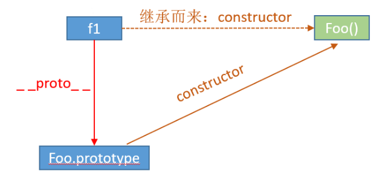

- [原文：帮你彻底搞懂JS中的prototype、\_\_proto__与constructor](https://blog.csdn.net/cc18868876837/article/details/81211729)
- [F.prototype](https://zh.javascript.info/function-prototype)
- `__proto__`和`constructor`属性是**对象**所独有的
- `prototype`属性是**函数**所独有的 *函数也是一种对象*


*图中蓝色方块中，大写的部分其实是个**构造函数***

## \_\_proto__

- 指向`原型对象`/父对象
- 该属性在ES标准定义中的名字应该是`[[Prototype]]`
- 具体实现是由浏览器代理自己实现
- 作用：当访问一个对象的属性时，如果该对象内部不存在这个属性，那么就会去它的`__proto__`属性所指向的那个对象里找
- 原型链尽头是`Object`

> Object.\_\_proto\_\_ = null

## prototype

- 指向`函数的原型对象`
- 函数独有的属性
- 作用：包含可以由特定类型的所有实例共享的属性和方法
- 任何函数在创建的时候，其实会默认同时创建该函数的`prototype对象`
- 指向这个函数（其实所有函数都可以作为构造函数）所创建的实例的原型对象

```javascript
f = new Foo();
f.__proto__ === Foo.prototype;	// true
```

> f.\_\_proto__ === Foo().prototype
> \>\>> Uncaught TypeError: Cannot read property 'prototype' of undefined
>
> 这是因为 Foo 是函数对象，Foo() 是在调用这个函数

```javascript
function Foo() {
	console.log(this)
}
f1 = new Foo()
f2 = new Foo()
f1.__proto__.kkk = 1
console.log(f1.__proto__)
console.log(f2.__proto__)
console.log(Foo.prototype)
```

> Foo {}
> Foo {}
> { kkk: 1 }
> { kkk: 1 }
> { kkk: 1 }

## constructor

- 指向该对象的`构造函数`
- constructor 属性的终点就是 Function 这个函数
- 实例化得到的对象其实自己是不具有 constructor 属性



## 手写 instanceOf

```javascript
// left 是个实例化得到的对象
// right 是个构造函数
function myInstanceOf(left, right) {
    left = left.__proto__;
    right = right.prototype;
    while (true) {
        if (!left) {
            return false;
        }
        if (left === right) {
            return true;
        }
        left = left.__proto__;
    }
}
```

## 不推荐直接使用\_\_proto__

> \_\_proto__ 被认为是过时且不推荐使用的（deprecated），这里的不推荐使用是指 JavaScript 规范中规定，**proto** 必须仅在浏览器环境下才能得到支持。

现代的方法有：

- Object.create(proto, \[descriptors\])：利用给定的 `proto` 作为 `[[Prototype]]` 和可选的属性描述来创建一个空对象。
- Object.getPrototypeOf(obj)：返回对象 `obj` 的 `[[Prototype]]`。
- Object.setPrototypeOf(obj, proto)：将对象 `obj` 的 `[[Prototype]]` 设置为 `proto`。