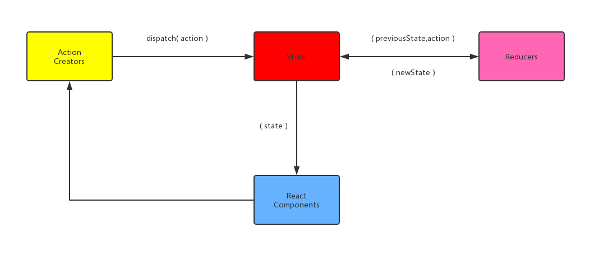

[Redux 中文文档](https://cn.redux.js.org/)



> 应用中所有的 state 都以一个对象树的形式储存在一个单一的 *store* 中。 惟一改变 state 的办法是触发 *action*，一个描述发生什么的对象。 为了描述 action 如何改变 state 树，你需要编写 *reducers*。

## 原则

1. 单一数据源

   整个应用的`state`被储存在一棵 object tree 中，并且这个 object tree 只存在于**唯一**一个`store`中

2. State 是只读的

   唯一改变`state`的方法就是触发`action`，`action`是一个用于描述**已发生**事件的普通对象

3. 使用纯函数来执行修改

   为了描述`action`如何改变 state tree ，需要编写`reducer`

## action

- 约定：`action`内必须使用一个字符串类型的`type`字段来表示将要执行的动作

- `action`只是描述了有事情发生了这一事实，并没有描述应用如何更新 state

- `action`其他属性均为自定，用于传递更新 state 需要的数据

- 当应用规模越来越大时，建议使用单独的模块或文件来存放`action`

  ```js
  import { ADD_TODO, REMOVE_TODO } from '../actionTypes'
  ```

- 使用函数创建`action`，便于移植和测试

  ```js
  function addTodo(text) {
      return {
          type: ADD_TODO,
          text
      }
  }
  dispatch(addTodo(text))
  ```

## reducer

> reducer 就是一个纯函数，接收旧的 state 和 action，返回新的 state。
> (prevState, action) => newState

#### 保持 reducer 纯净

- **不要**修改传入参数
- **不要**执行有副作用的操作，如 API 请求和路由跳转
- **不要**调用非纯函数，如 `Date.now()` 或 `Math.random()`

## store

Store 有以下职责：

- 维持应用的 state
- 提供`getState()`方法获取 state
- 提供`dispatch(action)`方法更新 state
- 通过`subscribe(listener)`注册监听器
- 通过`subscribe(listener)`返回的函数注销监听器

## react-redux

> 技术上讲，可以直接使用 `store.subscribe()` 来编写容器组件。但不建议这么做的原因是无法使用 React Redux 带来的性能优化。也因此，不要手写容器组件，而使用 React Redux 的 `connect()` 方法来生成。

- \<Provider>
- connect()

