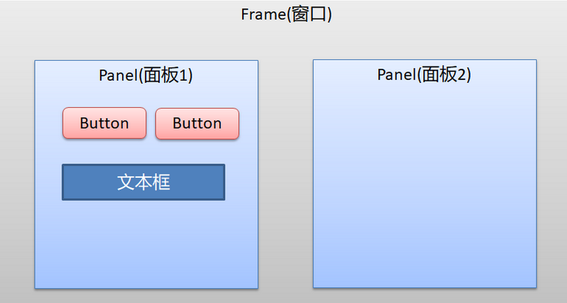
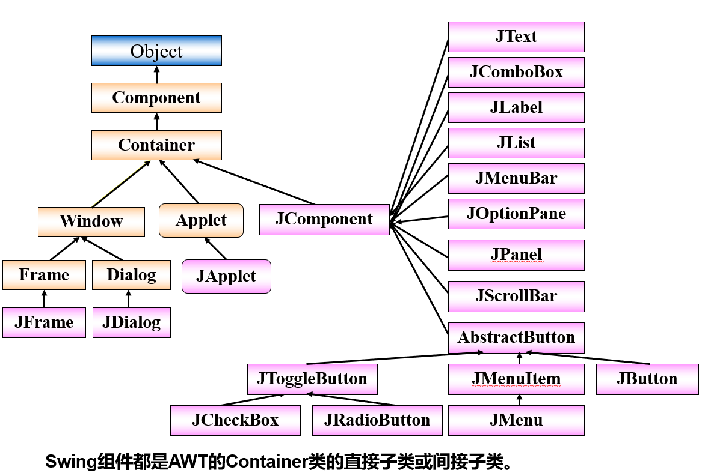
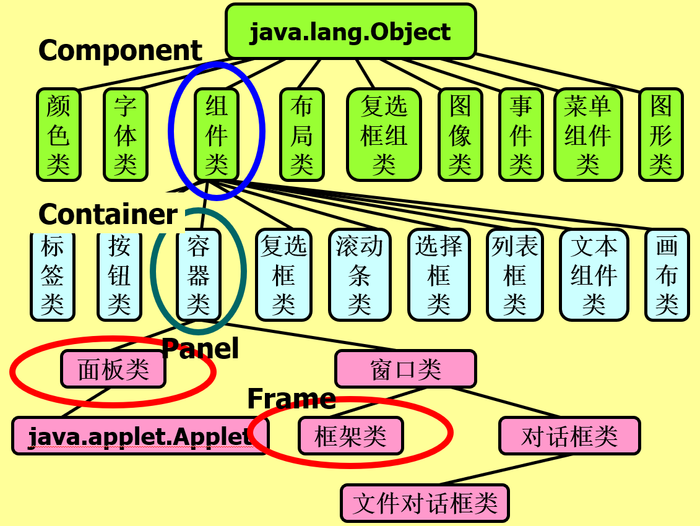
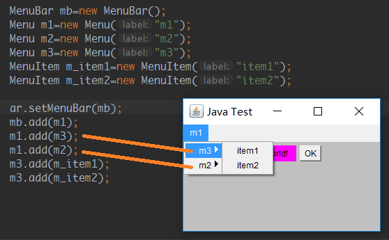
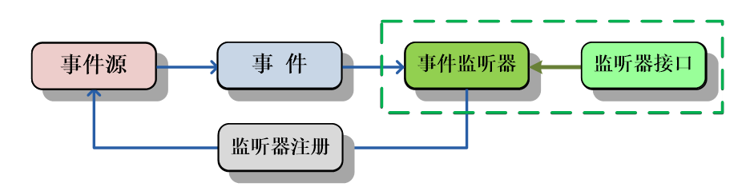
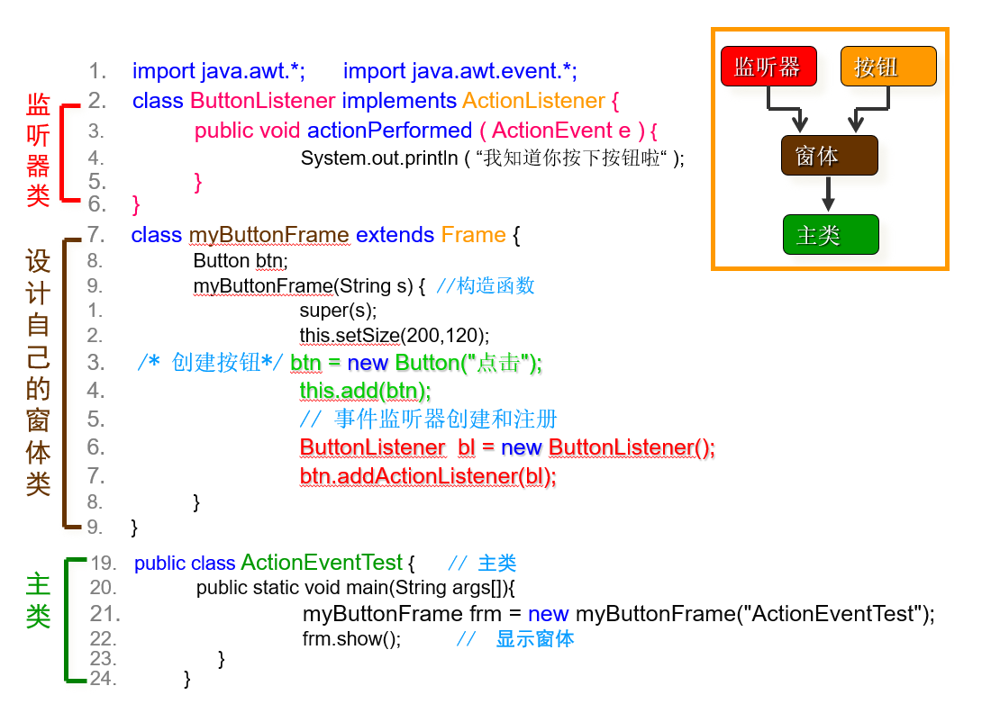

### 1.GUI控件分类

- 组件(Component)： 基本图形元素,如按钮,文本框,文本域,多选按钮,单选按钮等
- 容器(Container) 可以容纳组件的区域，在容器上可以添加别的组件。如Frame, Window等 
- 注意:容器中可以容纳组件，也可以容纳比它“容量级别 小”的容器 

### 2.GUI包分类

- java.awt包：java.awt包中提供了大量的进行GUI设计所使用的类和接口，是Java语言进行GUI程序设计的基础。
- javax.swing包：swing是由100%纯Java实现的，没有本地代码，不依赖操作系统的支持，它的出现使得Java的图形用户界面上了一个台阶。

### 3.布局管理器

- 容器中的的组件排列方式：FlowLayout，BorderLayout，GridLayout，CardLayout，GridBagLayout
- 每个容器(Container)对象都有一个与它相关的布局管理器，其由setLayout()方法设定
- [原文](http://www.cnblogs.com/xingyunblog/p/3841031.html)
- [Layout Manager](https://blog.csdn.net/a_lonely_dancer/article/details/52577176)

### 4.菜单

- 只有Frame能添加菜单，不能将菜单组件直接添加到一般的容器中
- AWT提供的菜单机制是这样的：一个容器包含一个菜单条（MenuBar），一个菜单条中包含多个菜单（Menu），一个菜单中包含多个菜单或菜单项（MenuItem）
- 和菜单相关的组件有四个：MenuBar, Menu, MenuItem, CheckboxMenuItem
- 菜单组件提供了一个基本的下拉式菜单，它可以加入到一个菜单条或者另一个菜单中。
- 若一个menu被同时add到另外的两个menu中，只会被加入在后加入的menu
- 按添加顺序显示

### 5.事件

- 设计处理事件的类时，就要实现这个接口
- Java内部类：[详解](http://www.runoob.com/w3cnote/java-inner-class-intro.html) [总结](http://www.runoob.com/w3cnote/java-inner-class-summary.html)
- 每一个事件类都有唯一的事件处理方法接口，例如，对于处理鼠标事件“ActionEvent”类的对应接口为“ActionListener”
- 每一个接口中都已经规定了一个空的抽象方法在该方法中编码实现自己想做的的工作

- **事件源**：描述人机交互中事件的来源`EventSource`，通常是Java图形包中**组件**
- **事件**：事件源产生的交互内容，如“按下鼠标”`ActionEvent`在java.awt.event包中定义的**类**
- **事件监听器**：接收事件并进行处理，由**程序员编写**`ActionListener`对应处理所监听事件源产生的事件 
- **监听器接口**：编写“事件监听器”的“规定”——**抽象方法**，必须在监听器类中实现这些方法完成事件处理
- **监听器注册**：将事件监听器对象**绑定**到事件源，进行监听

#### 5.1.常用事件类

| 事件类型        | 典型触发动作                                                 |
| --------------- | ------------------------------------------------------------ |
| **ActionEvent** | `按钮`、列表双击、单击菜单项目                               |
| **KeyEvent**    | `键盘`的输入                                                 |
| **MouseEvent**  | `鼠标`拖动、移动、单击、按下、释放或者进入、退出组件的事件   |
| ComponentEvent  | 组件被隐藏、移动、尺寸调整或变为不可见的事件                 |
| FocusEvent  | 组件获得或失去焦点的事件                                     |
| InputEvent  | 复选框和列表项单击、控件的选择和可选菜单项的选择事件         |
| TextEvent   | 文本区域或者文本区域的值的改动                               |
| WindowEvent | 窗口激活、失去活动窗口、最小化、最小化、打开、关闭或者退出的事件 |

#### 5.2.常用事件监听器类

| 事件类型           | 典型动作                                                     |
| ------------------ | ------------------------------------------------------------ |
| **ActionListener** | 处理`按钮`、列表双击、单击菜单项目                           |
| **KeyListener**    | 处理`键盘`的输入                                             |
| **MouseListener**  | 处理`鼠标`拖动、移动、单击、按下、释放或者进入、退出组件的事件 |
| ComponetListener   | 处理组件被隐藏、移动、尺寸调整或者变为不可见的事件           |
| FocusListener      | 处理组件获得或失去焦点的事件                                 |
| TextListener       | 处理文本区域或者文本区域的值的改动                           |
| WindowListener     | 处理窗口激活、失去活动窗口、最小化、最小化、打开、关闭或者退出的事件 |

#### 5.3.Example

