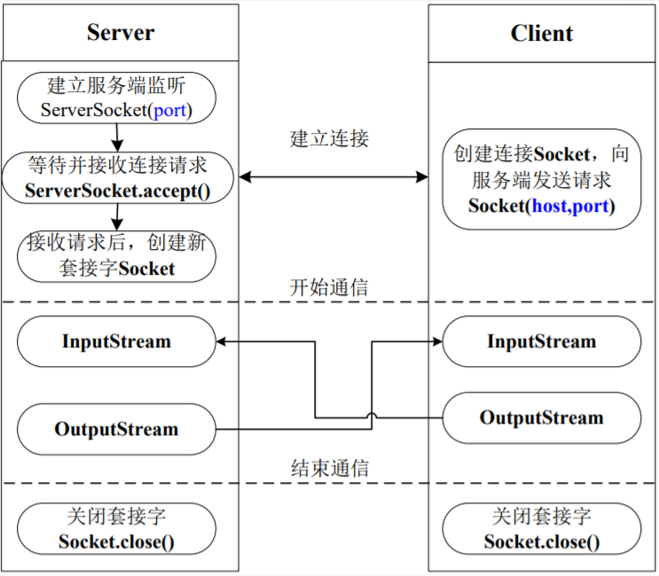
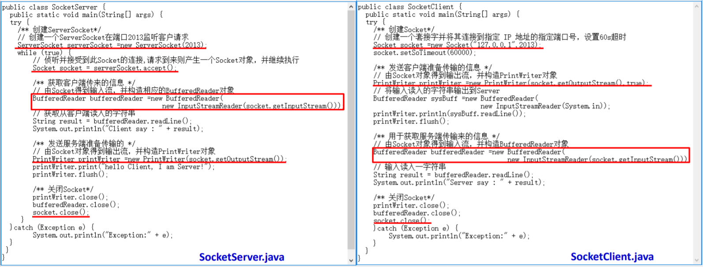

### [Java - 网络编程总结](https://www.jianshu.com/p/ae5e1cee5b04)

### 1.建立连接的过程

- 服务器端生成一个`ServerSocket`实例对象，随时监听客户端的连接请求
- 客户端生成一个`Socket`实例对象，并发出连接请求
- 服务器端通过`accept()`方法接收到客户端的请求后，新建一个`Socket`与之进行连接
- 通信都是通过一对`InputStream`和`OutputStream`进行的
- 通信结束后，两端分别关闭对应的`Socket`

### 2.基于TCP的Socket编程实例

