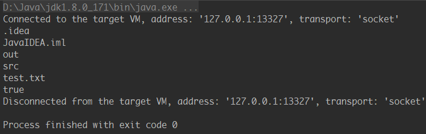
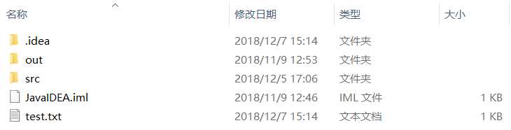

```java
import java.io.File;
import java.io.FileOutputStream;

public class TemporaryTest{
    public static void main(String[] args){
        try{
            File path_root=new File(".");
            String[] fileList=path_root.list();
            for(String item:fileList)
                System.out.println(item);

            File destination_file=new File(".\\test.txt");
            String str="test";
            byte[] b=str.getBytes();
            System.out.println(destination_file.exists());
            if(!destination_file.exists())
                destination_file.createNewFile();
            FileOutputStream fos=new FileOutputStream(destination_file);
            fos.write(b);
            fos.close();
        }catch (Exception e){
            System.out.println(e.getMessage());
        }
    }
}
```



