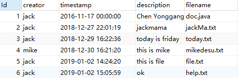
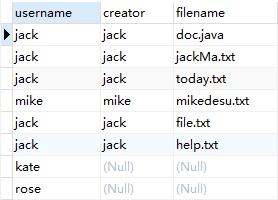
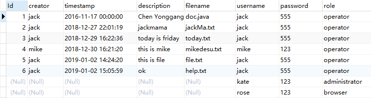

user_info


doc_info




`left join`：从左表返回所有的行，即使右表中没有匹配。如果右表中没有匹配，则结果为NULL。

```sql
SELECT
	user_info.username,
	doc_info.creator,
	doc_info.filename
FROM
	user_info
LEFT JOIN doc_info
ON user_info.username = doc_info.creator;
```




`right join`：从右表返回所有的行，即使左表中没有匹配。如果左表中没有匹配，则结果为NULL。

```sql
SELECT
	* 
FROM
	doc_info
RIGHT JOIN user_info
ON user_info.username = doc_info.creator;
```

