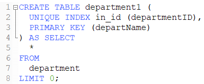

### 1.[SQL 语法入门 - jikexueyuan.com](http://wiki.jikexueyuan.com/project/sql/rdbms-concepts.html)

### 2.MySQL

- MySQL安装位置\MySQL Server 8.0\bin
- 运行命令：`mysql -u root –p` (登录数据库)

### 3.数据库Database

- 创建数据库：`CREATE DATABASE;`

- 显示所有数据库：`SHOW DATABASES;`

- 显示指定数据库：`SHOW CREATE DATABASE <DatabaseName>;`

- 修改数据库：`ALTER DATABASE <DatabaseName> DEFAULT <Options>;`

  - [DEFAULT] CHARACTER SET 字符集名
  - [DEFAULT] COLLATE 校对规则名

- 删除数据库：`DROP DATABASE [IF EXISTS]<DatabaseName>;`

### 4.表[^Table]

- 显示所有的表：`SHOW TABLES;`

- 显示表结构：`DESCRIBE <TableName>;`

- [表的存储引擎](https://blog.csdn.net/wyzxg/article/details/7412969)

- [ALTER TABLE](https://www.runoob.com/sql/sql-alter.html)

  - `ALTER TABLE table_name ADD column_name datatype;`
  - `ALTER TABLE table_name DROP COLUMN column_name;`

- [创建表的LIKE和AS](https://blog.csdn.net/leshami/article/details/46800847) （[小结](https://blog.csdn.net/risingsun001/article/details/23449241)）

- Example

  

  创建与department表相同结构的表department1，并将departName设为主键，departmentID上建立一个索引，并不插入旧表数据

### 5.索引[^Index]

- 创建索引

  - `CREATE [UNIQUE|FULLTEXT] INDEX 索引名 [索引类型] ON 表名 (索引列名) [索引选项];`
  - 索引列名＝列名[(长度)][ASC|DESC]
  - 索引类型＝`USING {BTREE|HASH}`
  - 唯一索引：`UNIQUE`
  - 全文索引：`FULLTEXT`
  - 复合索引：`CREATE INDEX index_name ON table_name(index_column1,index_column2...)`

- 查看索引

  - `SHOW INDEX FROM table_name;`

- 删除索引

  - `DROP INDEX index_name ON table_name;`

- [在创建数据表时创建索引](https://blog.csdn.net/qq_41573234/article/details/80250279)

### 6.存储过程[^Stored Procedure]

- [MySQL存储过程 - runoob.com](https://www.runoob.com/w3cnote/mysql-stored-procedure.html)
- [MySQL数据库存储过程 - CSDN](https://blog.csdn.net/moxigandashu/article/details/64616135)

### 7.触发器[^Trigger]

- [触发器 - cnBlog](https://www.cnblogs.com/CraryPrimitiveMan/p/4206942.html)