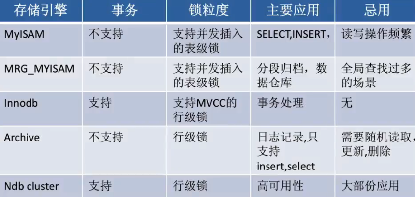

#### 1.基本概念

- 关系：一张表
- 元组：表中的一行
- 属性：表中的一列。每列都有名称，为属性名
- 候选码：唯一的确定表中的一行，为属性或属性组
- 主键：一个关系中有多个候选码，选定其中一个为主码
- 域：属性的取值范围
- 分量：元组中的一个属性值

#### 2.常见的 DBMS

- 商业级：Oracle,SqlServer
- 开源：MySQL,PgSQL

#### 3.MySQL常用存储引擎

- MyISAM

- InnoDB

  