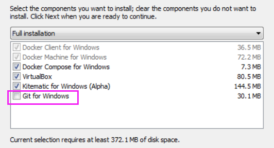

#### 1.下载Docker Toolbox for Windows

- [官方指导文档](https://docs.docker.com/toolbox/toolbox_install_windows/)
- To download the latest version of Docker Toolbox, go to [Toolbox Releases](https://github.com/docker/toolbox/releases) and download the latest `.exe` file.
- 参考指导：
  1. [如何在windows安装docker toolbox - CSDN](https://blog.csdn.net/xbinworld/article/details/78945879)
  2. [Windows Docker 安装 - runoob.com](https://www.runoob.com/docker/windows-docker-install.html)

#### 2.[解决docker-machine 初始化下载 book2docker.iso 过慢的问题](https://juejin.im/entry/5bec241ce51d455a175148fe)

1. 先运行一次Docker Quickstart Terminal，使得目录出现

   ./Users/<username>/.docker/machine/cache

2. [下载 book2docker.iso（最新版本）](https://github.com/boot2docker/boot2docker/releases)

3. 下好的.iso放入目录下，重新运行Docker Quickstart Terminal

#### 3.[解决点击Docker出现windows 正在查找bash.exe的问题](https://blog.csdn.net/A632189007/article/details/78601213)

由于安装时未勾选`Git for windows`，需要手动查找Git bash的位置。

例如：D:/Program Files/Git**/bin/bash.exe**

