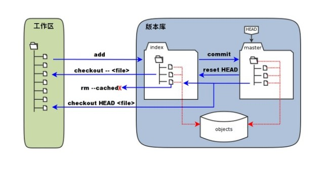
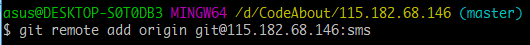
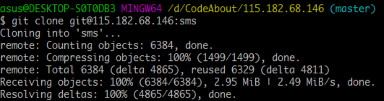
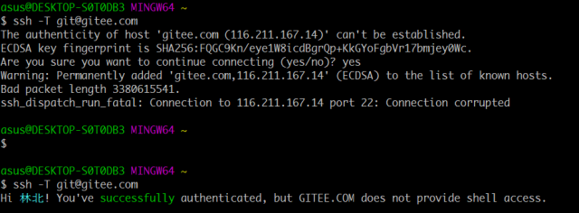

#### 1.[基本的Git概念](https://www.jianshu.com/p/df4f947d99e9)

#### 2.[Git 工作区、暂存区和版本库](http://www.runoob.com/git/git-workspace-index-repo.html)

- 工作区：就是你在电脑里能看到的目录
- 暂存区：（stage / index）一般存放在`.git`目录下的index文件（.git/index）中
- 版本库：工作区有一个隐藏目录`.git`，这个不算工作区，而是Git的版本库
- [工作区、暂存区、版本库 - 廖雪峰](https://www.liaoxuefeng.com/wiki/0013739516305929606dd18361248578c67b8067c8c017b000/0013745374151782eb658c5a5ca454eaa451661275886c6000)

#### 3.[Git教程](https://www.liaoxuefeng.com/wiki/0013739516305929606dd18361248578c67b8067c8c017b000)

- 创建版本库

  - 初始化一个Git仓库，使用`git init`命令。

  - 添加文件到Git仓库，分两步：

    - 使用命令`git add <file>`，注意，可反复多次使用，添加多个文件
    - 使用命令`git commit -m <message>`，完成

- 查看修改

  - 使用`git status`命令，掌握工作区的状态
  - 如果git status告诉你有文件被修改过，用`git diff`可以查看修改内容

- 版本回退

  - **HEAD** 指向的版本就是当前版本，因此，Git允许我们在版本的历史之间穿梭，使用命令

    `git reset --hard <commit_id>`

  - 用`git log`可以查看提交历史，以便确定要回退到哪个版本

  - 用`git reflog`查看命令历史，以便确定要回到未来的哪个版本

- 撤销修改

  - 直接丢弃工作区的修改时，用命令`git checkout -- file`

  - 丢弃添加到缓存区的修改：

    - `git reset HEAD <file>` 此时工作区的修改还未丢弃
    - `git checkout -- file` 丢弃工作区的修改

  - 用版本库里的版本替换工作区的版本`git checkout`

- [远程仓库](https://www.liaoxuefeng.com/wiki/0013739516305929606dd18361248578c67b8067c8c017b000/001374385852170d9c7adf13c30429b9660d0eb689dd43a000)

  - 找一台电脑充当服务器的角色，每天24小时开机，其他每个人都从这个“服务器”仓库克隆一份到自己的电脑上，并且各自把各自的提交推送到服务器仓库里，也从服务器仓库中拉取别人的提交

- 添加远程库

  - 关联一个远程库 git remote add origin git@server-name:path/repo-name.git
  
    
  
  - 第一次推送 **master** 分支的所有内容`git push -u origin master`
  - 推送最新修改`git push origin master`

- [从远程库克隆](https://www.liaoxuefeng.com/wiki/0013739516305929606dd18361248578c67b8067c8c017b000/001375233990231ac8cf32ef1b24887a5209f83e01cb94b000)

  - git clone

    

- [分支删除](https://blog.csdn.net/qq_32452623/article/details/54340749)

  - `git branch -a`
  - `git branch -d <BranchName>`
  - `git push origin --delete <BranchName>`

#### 4.[Git与TortoiseGit基本操作 ](https://blog.csdn.net/renfufei/article/details/41647973)

#### 5.[生成/添加SSH公钥(gitee)](https://gitee.com/help/articles/4181#article-header0)

#### 6.[使用Git将码云上的代码Clone至本地](https://www.cnblogs.com/yi0921/p/7928985.html)

Clone项目：找到项目的SSH地址，命令行输入 $ git clone "SSH地址"，完毕之后项目将会被Clone至选择的目录下。

#### 7.[集中式和分布式](https://www.liaoxuefeng.com/wiki/0013739516305929606dd18361248578c67b8067c8c017b000/001374027586935cf69c53637d8458c9aec27dd546a6cd6000)

CVS及SVN都是集中式的版本控制系统，而Git是分布式版本控制系统