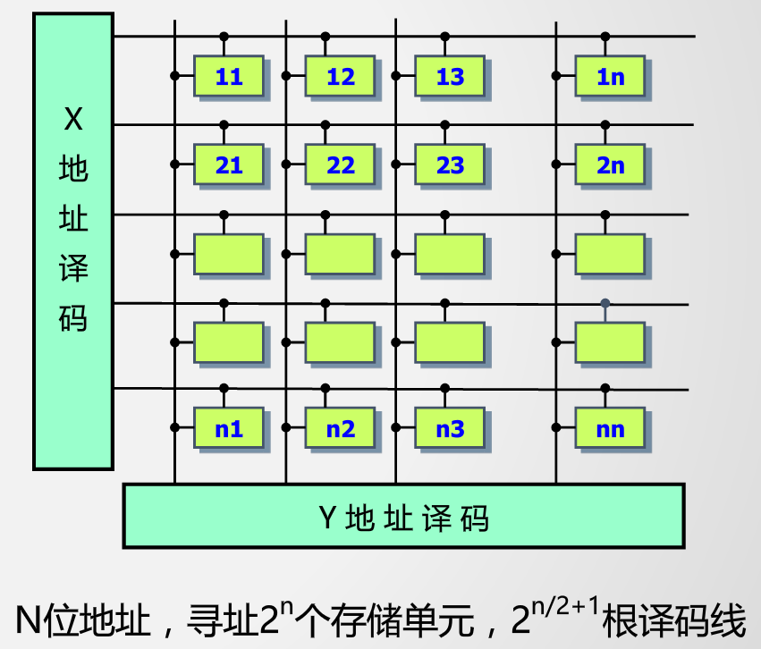
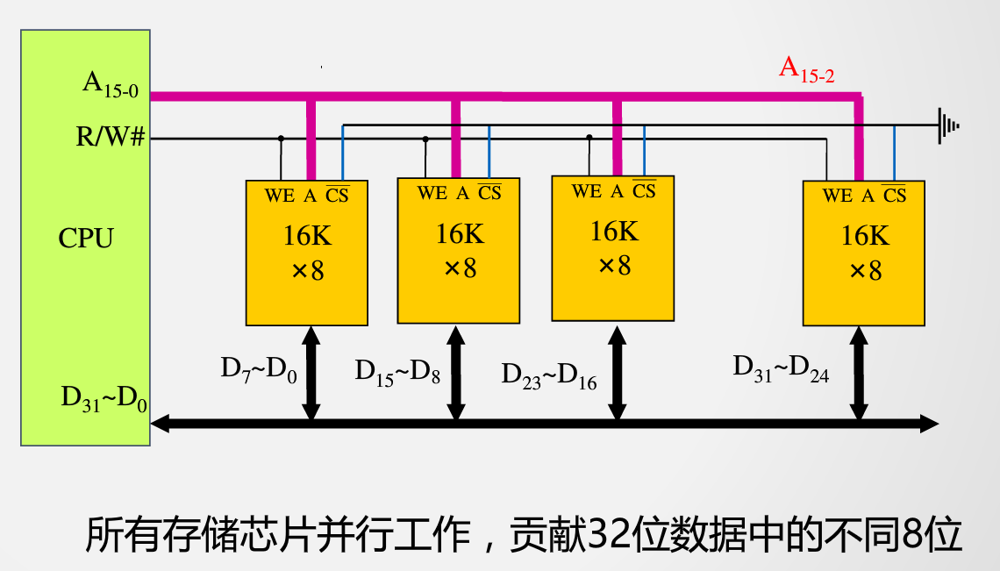
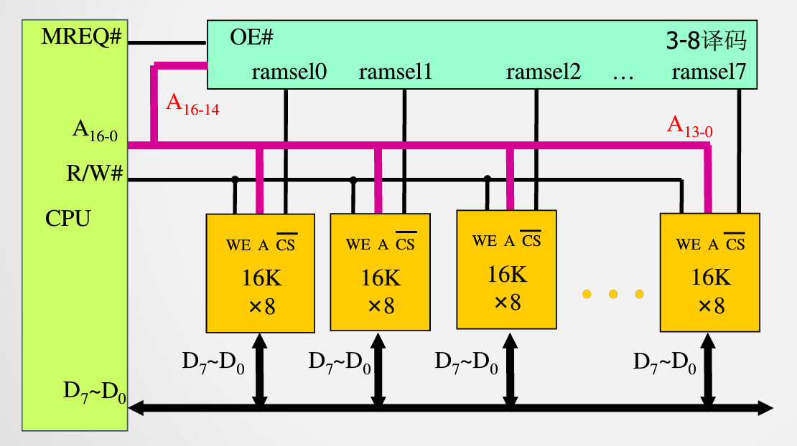
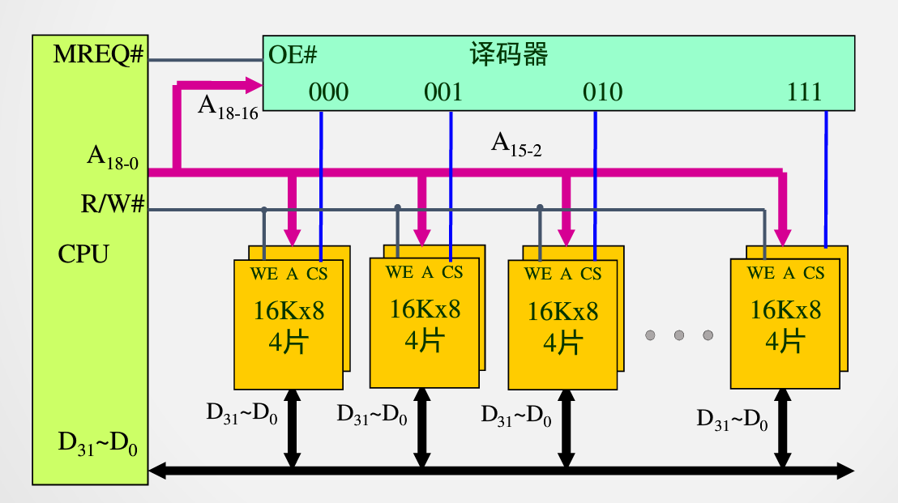
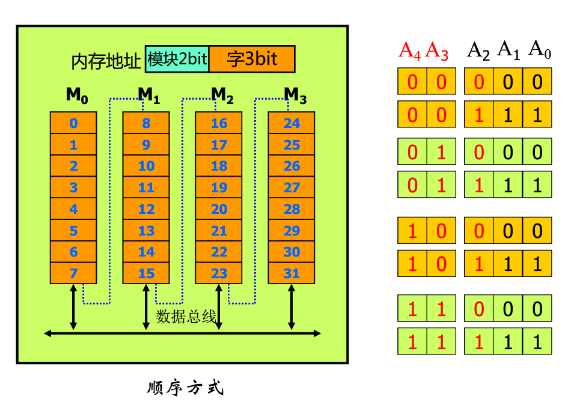
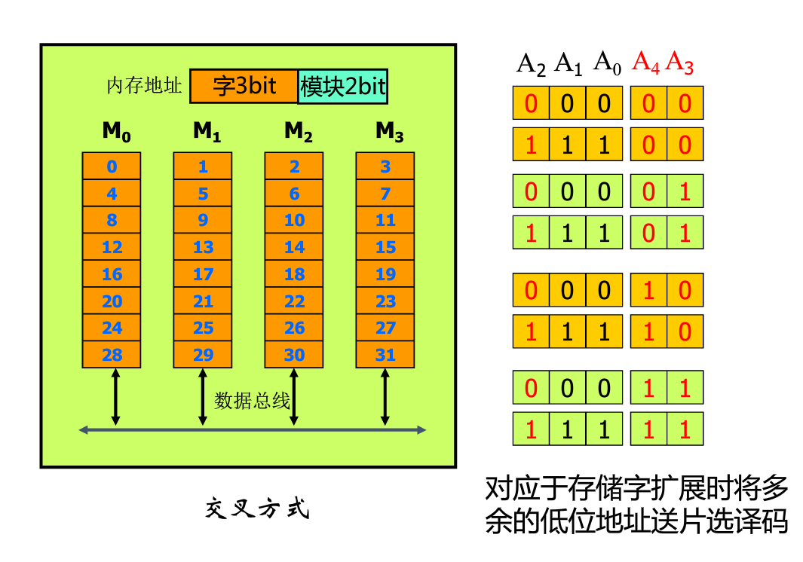
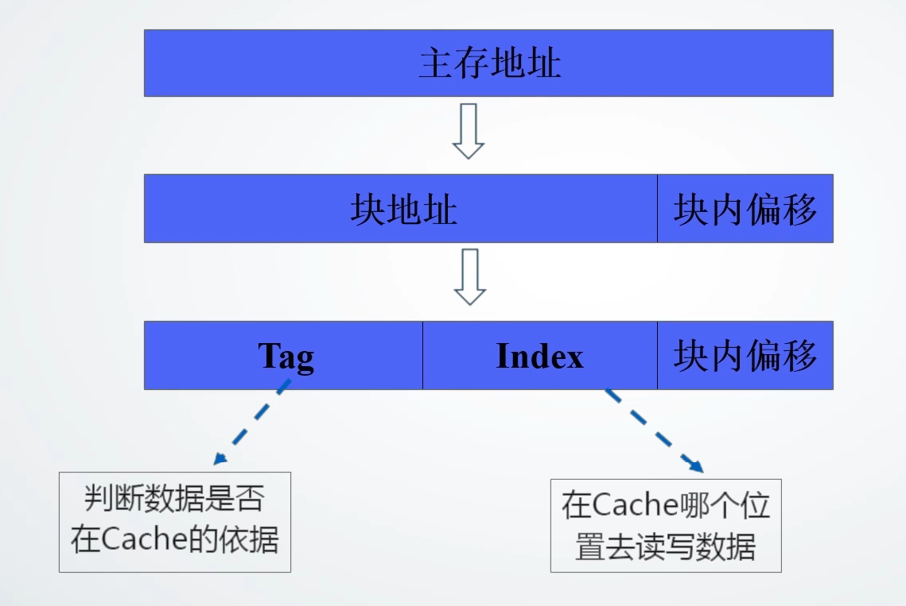
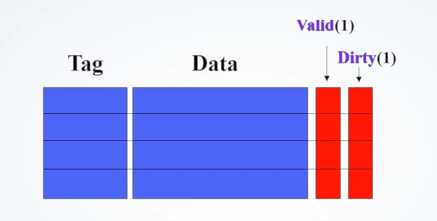

[课程地址](https://www.icourse163.org/course/HUST-1003159001?tid=1206776230)

### 第四章 存储系统

#### 4.1 [存储系统的层次结构](https://www.icourse163.org/learn/HUST-1003159001?tid=1206776230#/learn/content?type=detail&id=1211610884&sm=1)

##### 局部性原理

- 时间局部性
- 空间局部性

#### 4.2 [主存中的数据组织](https://www.icourse163.org/learn/HUST-1003159001?tid=1206776230#/learn/content?type=detail&id=1211610885&sm=1)

##### 字的边界对齐问题

- 按边界对齐的数据存储
- 未按边界对齐的数据存储

#### 4.3 [静态随机存储器 SRAM](https://www.icourse163.org/learn/HUST-1003159001?tid=1206776230#/learn/content?type=detail&id=1211610886&sm=1)

##### 三种状态

- 读
- 写
- 保持

##### 双译码结构

#### 4.4 [动态随机存储器 DRAM](https://www.icourse163.org/learn/HUST-1003159001?tid=1206776230#/learn/content?type=detail&id=1211610887&sm=1)

##### SRAM存储单元的不足

- 晶体管过多
- 存储密度低
- 功耗大

##### 四种状态

- 读
- 写
- 保持
- 刷新

##### DRAM存储单元的刷新

- **刷新周期**：两次刷新之间的时间间隔
- 双译码结构的DRAM刷新按**行**进行

##### DRAM的刷新方式

- 集中刷新
- 分散刷新
- **异步刷新**

#### 4.5 [存储扩展](https://www.icourse163.org/learn/HUST-1003159001?tid=1206776230#/learn/content?type=detail&id=1211610888&sm=1)

##### 基本概念

- 存储扩展都需要完成CPU与主存间地址线、数据线、控制线的连接
- M×N
  - M：容量/字长
  - N：位数

##### 存储扩展的类型

- 位扩展：扩展位数
- 字扩展：扩展容量
- 字位扩展

##### 示例

1. 用**16K×8**的存储芯片构建**16K×32**的存储器

2. 用**16K×8**的存储芯片构建**128K×8**的存储器

   128K存储器->17根地址线

   16K存储芯片->14根地址线

   多余3根地址线作为**片选译码**输入

3. 用**16K×8**的存储芯片构建**128K×32**的存储器

#### 4.6 [多体交叉存储器](https://www.icourse163.org/learn/HUST-1003159001?tid=1206776230#/learn/content?type=detail&id=1211610890&sm=1)

##### 高位多体交叉存储器的组织方式

- 数据组织特点

  相邻地址的处于同一存储体

- 一个地址寄存器
- 多模块串行：局部性原理

##### 低位多体交叉存储器的组织方式

- 数据组织特点

  相邻地址处于不同的存储体中

- 每个存储体均需地址寄存器

- 多模块并行：局部性原理

#### 4.7 [Cache的基本原理](https://www.icourse163.org/learn/HUST-1003159001?tid=1206776230#/learn/content?type=detail&id=1211610891&cid=1214401739&replay=true)

1. 任何存在速度差异的地方都配置有`高速缓冲存储器`
2. 功能：缓解快速CPU和慢速的主间的速度差异
3. 理论基础：局部性原理
4. CPU和Cache按`字`交换，Cache和主存按`块`交换

##### Cache地址映射机制

##### Cache的结构

- 每`行`大小与主存`块`相同
- `Tag`：从CPU访问主存的地址中剥离得到
- `Data`：与主存交换的**数据块**
- `Valid`：是否有效
- `Dirty`：是否最新（可能被DMA弄脏）

#### 4.8 [相联存储器](https://www.icourse163.org/learn/HUST-1003159001?tid=1206776230#/learn/content?type=detail&id=1211610892&cid=1214401742&replay=true)

1. 作用：判断CPU要访问的内容是否在Cache中
2. 基本思路：根据不同的规则抽取主存地址的`部分内容`作为查找依据

#### 4.9 [Cache地址映射与变换方法](https://www.icourse163.org/learn/HUST-1003159001?tid=1206776230#/learn/content?type=detail&id=1211610893&cid=1214401745&replay=true)