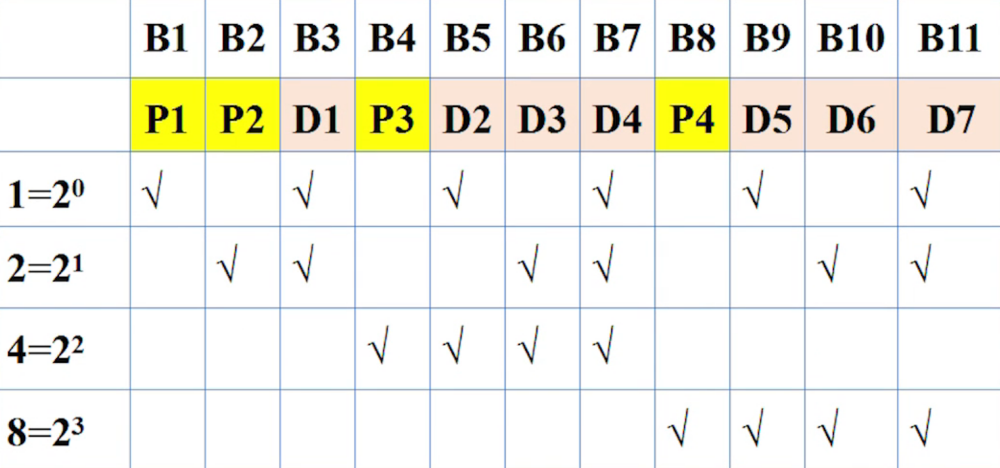
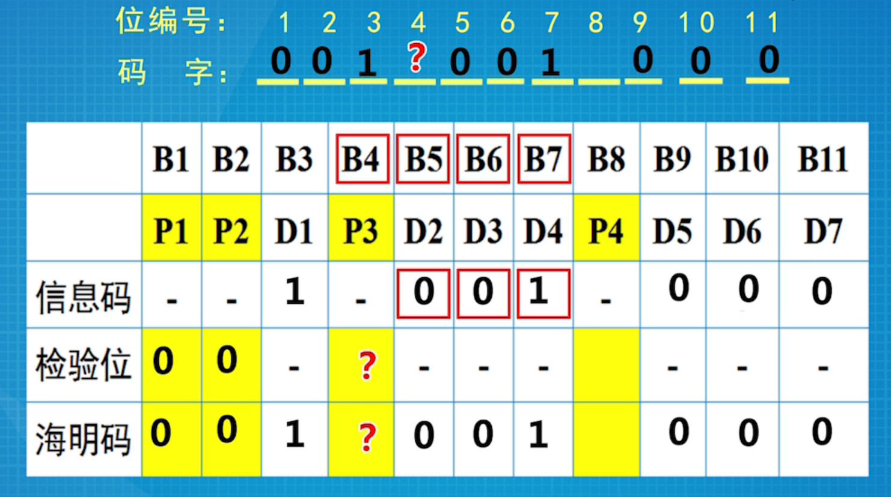

## 第一章 概述

### 1.3 [常用基本概念](https://www.icourse163.org/learn/SCUT-1002700002?tid=1206622278#/learn/content?type=detail&id=1211470282)

#### 拓扑

- **信道**的分布方式
- 常见结构：总线型、星型、环形、树形、网状

#### 协议

一系列规则和约定的规范性描述

#### 网络按规模划分

1. PAN
2. LAN
3. MAN
4. WAN
5. Internet

### 1.4 [参考模型](https://www.icourse163.org/learn/SCUT-1002700002?tid=1206622278#/learn/content?type=detail&id=1211470283&sm=1)

#### 典型分层模型

- OSI七层模型
- **TCP/IP四层模型**

#### TCP/IP参考模型

1. 应用层`Application Layer`
2. 传输层`Transport Layer`
3. 网络层`Internet Layer`
4. 网络接入层`Network Access Layer`

*教程中将网络接入层分为 Data Link Layer 和 Physical Layer*

### 1.5 [参考模型相关概念](https://www.icourse163.org/learn/SCUT-1002700002?tid=1206622278#/learn/content?type=detail&id=1211470284&cid=1214124648)

#### 实体 Entity

- 每层中活动的元素
- 负责完成封装、解封装等基本功能
- 对等实体：Peer Entity，收发双方对应层上的实体

#### 虚拟通信

收发双方的对应层之间有一根直接的通道（虚通道）。沿着虚通道，`PDU`（协议数据单元）从发方到达收方

协议数据单元PDU

## 第二章 物理层

### 2.1 [概述](https://www.icourse163.org/learn/SCUT-1002700002?tid=1206622278#/learn/content?type=detail&id=1211470294&sm=1)

#### 主要功能

- 提供透明的比特流传输
- 不关心其中信息(0、1)，只负责正确搬运

#### 物理层的特性

- 机械特性
- 电气特性
- 功能特性
- 规程特性

#### 信号

- 物理层上数据的传输
- 模拟信号：对应时域的信号的取值是**连续**的
- 数字信号：对应时域的信号的取值是**离散**的
- 码元：不同离散值的基本波形

#### 物理带宽

- 传输过程中振幅**不会明显衰减**的频率范围
- 单位：赫兹
- 取决于介质材料的物理特性

#### 数字带宽

- 单位时间内，流经的信息总量

#### 物理带宽和数字带宽的关系

- 奈奎斯特定理：**无噪声**信道的情况
- 香农定理：**有噪声**信道的情况

### 2.2 [有导向的传输介质](https://www.icourse163.org/learn/SCUT-1002700002?tid=1206622278#/learn/content?type=detail&id=1211470295&cid=1214124676&replay=true)

#### 传输介质

- 引导性：有线
- 非引导性：无线

#### 有线传输介质

- 同轴电缆
- 双绞线
  - 非屏蔽双绞线`UTP`：在**局域网**中使用最多
  - 屏蔽双绞线`STP`
  - 网屏式双绞线
- 光纤
  - 带宽高、距离远，损耗低，不受电磁辐射干扰，易断裂
  - 通常以光缆形式存在

### 2.3 [复用技术](https://www.icourse163.org/learn/SCUT-1002700002?tid=1206622278#/learn/content?type=detail&id=1211470296&cid=1214124680&replay=true)

#### 特点

- 多用户共享同一根信道
- 干线起点共用，干线终点分离

#### 频分多路复用FDM技术

- 波分多路复用WDM技术
- 密集波分多路复用DWDM技术

#### 时分多路复用TDM技术

- 统计时分多路复用STDM技术

#### 码分多路复用CDMA技术

- 广泛用于3G

### 2.4 [调制技术](https://www.icourse163.org/learn/SCUT-1002700002?tid=1206622278#/learn/content?type=detail&id=1211470297&cid=1214124684&replay=true)

#### 调制机制使用信号来传输比特

- 基带传输`Baseband Transmission`
- 通带传输`Passband Transmission`

### 2.5 [公共交换电话网 PSTN](https://www.icourse163.org/learn/SCUT-1002700002?tid=1206622278#/learn/content?type=detail&id=1211470298&sm=1)

#### 主要构成

- 本地回路`Local Loop`
- 干线`Trunks`
- 交换局`Switching Offices`（包含端局）

#### 本地回路

- 传输模拟信号
- 经过**调制解调器**传到端局

#### 调制解调器

- 用于将计算机产生的数字比特流转变为载波输出（模拟信号）
- Modem，又称“猫”

#### 干线

- 多路复用
- 连接交换局（包括端局）的连接
- 通常使用光纤
- 端局里有**编解码器**`codec`
  - 模拟信号数字化/数字信号模拟化
  - 脉冲编码调制PCM

#### 交换局

- 电路交换`Circuit Switching`
  - 建立连接
  - 传数据
  - 拆除连接
  - 分配方式：**提前**分配
  - 收费方式：按**时间**
- 包交换`Packet Switching`（分组交换）
  - 允许包/分组存储在交换局的内存中
  - 独立寻径
  - 乱序送达
  - 分配方式：**按需**分配
  - 收费方式：按**流量**

### 2.6 [物理层设备](https://www.icourse163.org/learn/SCUT-1002700002?tid=1206622278#/learn/content?type=detail&id=1211470299&sm=1)

#### 收发器 Transceiver

- 将一种形式的信号**转变**成另一种形式的信号

- 早期是外设，现在是网卡上的部件
- 负责**收发**信号

#### 中继器 Reapter

- **再生信号**：去噪、放大
- 让线缆延申更远，突破UTP的限制
- **不能过滤**流量

#### 集线器 Hub

- 多端口的中继器
- 再生信号
- 不能过滤流量
- 早期以太网，集线器作为星型拓扑结构的中心，进行`广播`（从除了来的那个端口外所有其他端口转发出去）

#### 冲突

- 更多的用户争抢共享资源
- 冲突域增大，冲突的可能性变大，网络性能下降
- 使用了中继器和集线器，实际上是扩大了冲突域

#### 物理层设备

- 都是**傻瓜设备**，不具备过滤流量的功能
- **很少再使用**中继器、集线器（除光中继器以外）

## 第三章 数据链路层

### 3.1 [概述](https://www.icourse163.org/learn/SCUT-1002700002?tid=1206622278#/learn/content?type=detail&id=1211470309&sm=1)

#### 负责

- 差错检测和控制
- 流量控制
  - 基于速率
  - **基于反馈**

#### 成帧

- 字符计数法
  - 每帧的**第一个字段**，标识帧的长度
  - 一旦出错，后续的都出错
- 字节填充的标志字节法
  - 用**帧界**，特殊的一个字节，标记帧的开始和结束
  - 传输的数据中若是出现帧界，则在帧界前加上**转义符**
  - 帧，按**字节**为单位传递，**任意比特数**的帧不适用，必须是**8位**整数倍
- 比特填充的标志比特法
  - 以`01111110`为帧标记
  - 如果帧的内容中也出现了与帧标记相同的位串，则在传输中变成`011111010`
  - 5个`1`以后一定会插入一个`0`
- 物理层编码违例法
  - 帧界：冗余信号

#### 作用

- DataLink Layer 位于物理层之上，网络层之下
- 提供有效的、可靠的**帧**传输

### 3.2 [差错处理概述](https://www.icourse163.org/learn/SCUT-1002700002?tid=1206622278#/learn/content?type=detail&id=1211470310&cid=1214124723&replay=true)

#### 错误的处理

- 纠错：恢复出正确的数据
- 检错：仅仅检查出错误，往往伴随重传

#### 错误的种类

- 单个错误：分散在各个数据块
- 突发错误：整个块都是错误

#### 纠错码

- 前向纠错技术
- 有线网中极少采用，主要用于**无线网**

#### 检错码

- **局域网**中主要采用

#### 码字

- 包含数据位、检验位的 n 位单元（模式）
- 海明距离
  - 两个码字之间，不同位的数目
  - 可用`异或`计算，运算结果中`1`的个数
  - 如果海明距离为`d`，则一个码字需要发生`d`个1位错误才能变成另一个码字
  - 一组码字的海明距离：任意两个码字的海明距离中的**最小值**
- 海明距离为`d+1`的编码能**检测**出`d`位的差错
- 海明距离为`2d+1`的编码能**纠正**`d`位的差错
- 海明距离**越大**，纠错能力**越强**，合法码字减少，传输效率**降低**

### 3.3 [纠1位错的海明码](https://www.icourse163.org/learn/SCUT-1002700002?tid=1206622278#/learn/content?type=detail&id=1211470311&sm=1)

#### 冗余位和数据位的关系
- 冗余位：`r`
- 数据位：`m`
- 传输：`n=m+r`
- (m+r+1) ≤ 2r

#### 海明纠错码

- `n`从左到右编号
- 校验位：编号位为`2`的次幂
- 数据位：剩下的位
- 校验位的依据为包括自身在内的一些位的集合的奇偶值(采用奇校验/偶校验)

#### 校验位的决定

- 将某一位数据位的编号展开成`2`的乘幂的和，则每一位所对应的位即为该数据位的校验位

- 如：m = 7，r = 4

  

#### 编码

- 原数据：`1001000`，m = 7，r = 4，n = 11
- 使用`偶校验`

P3 = 只有一个`1`，校验码为`1`

|        |  B1  |  B2  |  B3  |  B4  |  B5  |  B6  |  B7  |  B8  |  B9  | B10  | B11  |
| :----: | :--: | :--: | :--: | :--: | :--: | :--: | :--: | :--: | :--: | :--: | :--: |
|        | `P1` | `P2` |  D1  | `P3` |  D2  |  D3  |  D4  | `P4` |  D5  |  D6  |  D7  |
| 信息码 |  -   |  -   |  1   |  -   |  0   |  0   |  1   |  -   |  0   |  0   |  0   |
| 检验位 | `0`  | `0`  |  -   | `1`  |  -   |  -   |  -   | `0`  |  -   |  -   |  -   |
| 海明码 | `0`  | `0`  |  1   | `1`  |  0   |  0   |  1   | `0`  |  0   |  0   |  0   |

#### 纠错

- 对每一位校验位进行校验
- 出错的数据位 = 出错的校验位的和

### 3.4 [检错码](https://www.icourse163.org/learn/SCUT-1002700002?tid=1206622278#/learn/content?type=detail&id=1211470312&cid=1214124731)

#### 分类

- 奇偶校验
- 互联网校验
- 循环冗余校验

#### 循环冗余检错码CRC

- `k`位的帧 = `k-1`次的多项式，最末端视作`0`次
- 例：1011001 => X6+X4+X3+X0

- **生成多项式**：G(x)，`r`阶
- m位帧的生成多项式：m > r，M(x) > G(x)
- 发方
  - XrM(x)/G(x) = Q(x)+R(x)
  - (XrM(x)-R(x))/G(x) = Q(x)
  - 编码后的码字：XrM(x)-R(x)
- 收方
  - (XrM(x)-R(x))**%**G(x)
  - 整除，说明接收正确

### 3.5 [基本数据链路层协议](https://www.icourse163.org/learn/SCUT-1002700002?tid=1206622278#/learn/content?type=detail&id=1211470313&sm=1)

#### 无限制的单工协议

- 假设
  - 数据单向传送
  - 收发双方的网络层都处于就绪状态
  - 处理时间忽略不计
  - 无限空间
  - 完美通道：信道不损坏、不丢帧
- 乌托邦协议

#### 单工停/等协议

- **半双工的协议**

- 取消了收方无限空间的假设
- 收方收到数据后，如果有能力处理，回发一个`哑帧`给发方
- 发方收到`哑帧`，可以再次发送下一帧数据

#### 有噪声信道的单工协议

- **肯定确认重传 PAR**

- 取消了完美信道、收方无限空间的假设
- 特点：`确认帧`，`定时器`
- 收方收到的帧通过校验，向发方发送`确认帧`
- 发方收到了`确认帧`，才会发送下一帧
- 发方在发送数据以后，启动一个`定时器`，期望在超期前，收到`确认帧`
- 发方在定时器超期以后，`重传帧`
- 区别帧和重传帧：帧的序号

#### 提高效率

- 全双工：不再区别收方、发方，可以`互发`数据
- 捎带确认：确认帧可以稍带到发送给对方的数据里
  - 外发的数据帧(s.ack)
  - `捎带确认`的定时器，超期则单独发送确认帧
- 批量发送：利用`停/等`的空闲时间

### 3.6 [滑窗协议](https://www.icourse163.org/learn/SCUT-1002700002?tid=1206622278#/learn/content?type=detail&id=1211470314&cid=1214124739&replay=true)

#### 两个窗口

- 发送窗口：已经发送，未确认
- 接收窗口：期望被接收的帧的序列号

#### 滑窗技术的原理

- 窗口数：1
- 帧的序号`seq`：只用一个比特，0/1，交替出现
- 确认帧`ack`：指对面发送的seq

#### 窗口滑动的条件

- 接收方
  - 收到帧的序列号，是期待接收的帧号
  - `frame_expected`+1
- 发送方
  - `ack`(收到的确认帧) = `next_frame_to_send`(曾经发出的帧号) 
  - `next_frame_to_send`+1

#### 重复帧的问题

在接收到确认帧之前，定时器超时，重新发送帧给对面，对面发现帧重复，再次发送确认帧回来。导致重复帧很多，但是正常工作。

#### 合适的窗口数 W

- 信道容量：一帧发出到目的期间，信道上能够容纳的帧的数量
- **带宽-延迟积**：`B×D`
- 窗口值：`2DB+1`

### 3.7 [回退N帧](https://www.icourse163.org/learn/SCUT-1002700002?tid=1206622278#/learn/content?type=detail&id=1211470315&sm=1)

- 连续的发送好多数据帧，其中一个帧出错，则丢弃错帧及后续的帧，后续`全部重传`
- 需要发送方付出更多的缓存代价
- 适合出错率较少的高速信道

#### 发送方的重传策略

- 出错帧以及所有的后续帧，缓存在发送窗口中
- 发送方连续发送至发送窗口满
- 对帧编号，**未被确认的帧缓存**
- 收到确认，释放确认帧所占用的缓冲区，滑动发送窗口
- 定时器超时，回退到超时的帧，顺序重传**最后被确认帧**以后 的缓存区中缓存的帧

#### 接收方

- 每收到**期望**的正确帧，上交网络层，回送确认

- 收到出错帧，丢弃，`回送`对接受的最后正确帧的确认(无法使用捎带确认)

#### 累计确认

- 发送seq = 0~7，回发ack = 7
- 暗含着对第7帧，及其之前所有的帧的确认

- 发送窗口
  - W ≤ MAX_SEQ
  - 防止出错时，无法区分`ack`是哪一个窗口的
  - 即每次发送的窗口的seq不能顺序排列相同，如：0~7，0~7，应为0~7，8~6，7~5

- 接收窗口：W = 1

### 3.8 [选择性重传](https://www.icourse163.org/learn/SCUT-1002700002?tid=1206622278#/learn/content?type=detail&id=1211470316&sm=1)

- 适用于通信环境质量糟糕，出错率较大的情况

#### 接收方

- 正常接收：上交网络层，回送确认`ack`，滑动接收窗口

- 丢弃出错帧，如果后续帧正确，`缓存`下来，回送对接收的**最后正确帧**的确认
- 收到重传帧：**将缓存帧排序上交**，回送确认`ack`，滑动接收窗口
- 避免等待发送方的出错帧超时，接收方在遇到出错帧时，使用`nak`（Negative-Acknowledgment)

#### 发送方

- 正常发送：对帧编号，等待确认的帧**缓存**
- 收到确认：释放确认帧所占缓冲区，滑动发送窗口
- 出错/超时：重传缓存的最后被确认帧**的后面**那一帧

#### 滑动窗口长度 W 的选择

- 发送窗口：W = (MAX_SEQ + 1)/2
- 避免**前后**两个窗口里的序列号出现**重复**
- 第一次回送的确认帧，如果丢失，发送方超时重新发送，此时如果接收方`期待`的帧里的序列号(后一个窗口)和发送方`重发`的帧里的序列号(前一个窗口）`重复`，则会出错
- 即：重传帧被当作新帧被接收

#### 三种协议的窗口大小

|                | 协议4：滑动窗口 | 协议5：回退N帧 | 协议6：选择性重传 |
| :------------: | :-------------: | :------------: | :---------------: |
| 发送窗口`SWnd` |      (0,1]      |  (0,MAX_SEQ]   |     [0,RWnd]      |
| 接收窗口`RWnd` |        1        |       1        |  (MAX_SEQ + 1)/2  |

##  第四章 介质访问控制子层

### 4.1 [MAC子层概述](https://www.icourse163.org/learn/SCUT-1002700002?tid=1206622278#/learn/content?type=detail&id=1211470325&sm=1)

#### Data Link Layer

- Logical Link Control Sublayer `LLC`
- Media Access Control Sublayer `MAC`

#### MAC

- 局域网里采用的数据通信方式：广播，`共享`传输介质
- 共享信道：广播信道/多路访问信道
- 介质的多路访问控制：确定下一个使用者（使用共享信道），即：`信道的分配`

#### 信道的分配

- 静态分配
  - **预先**分配给用户
  - 不同用户使用情况不同
  - 例：FDN，TDN（见2.3）
  - 适用
    - 用户数量**少**，用户**固定**
    - 通信量**大**，且流量**稳定**
- 动态分配
  - 信道开放，**临时动态**地分配
  - 没有预分配

#### 多路访问协议 Multiple Access Protocol

- 随机访问协议
  - 用户互相争抢信道
  - ALOHA协议，CSMA协议，**CSMA/CD协议**(以太网采用)

- 受控访问协议
  - 不会产生冲突

### 4.2 [ALOHA协议](https://www.icourse163.org/learn/SCUT-1002700002?tid=1206622278#/learn/content?type=detail&id=1211470326&sm=1)

#### 性能分析

- 吞吐率`Throughout`S
  - 在一个帧时内，发送成功的**平均帧数**
  - 0 < S < 1
  - 信道利用率100% -> S=1
- 运载负载`Carried Load`G
  - 一个帧时内，**所有**通信站总共发送的帧的**平均值**（包括原发，重发）
  - G ≥ S => 有冲突
  - G = S => 无冲突
  - G > 1 => 冲突频繁，产生大量重传
- P0
  - 一帧发送成功/未发生冲突的概率
  - **发送成功的帧**在**全部已发送帧**的总数中的比例

- S = G × P0

#### 纯ALOHA协议

- 冲突危险期：2T
- 信道利用率：18.4%
- 一旦产生新帧，`立即发送`，不顾是否有用户正在发送

#### 分隙ALOHA协议

- 冲突危险期：T

- 发送行为必须在`时隙的开始`，一旦发送开始时没有冲突，则该帧将成功发送

### 4.3 [CSMA协议](https://www.icourse163.org/learn/SCUT-1002700002?tid=1206622278#/learn/content?type=detail&id=1211470327&cid=1214124776&replay=true)

#### 载波监听多路访问协议

- Carrier Sense Multiple Access

- 改进的ALOHA协议
- `先听后发`

#### 非持续式CSMA

- 侦听到介质空闲，开始发送帧
- 侦听到介质正忙，等待一个`随机`的时间
- 如果等待的时间内，介质上没有数据传送，则造成浪费

#### 持续式CSMA [1-持续]

- 侦听到介质空闲，开始发送帧
- 侦听到介质正忙，`持续`侦听
- 如果发生`冲突`，等待一个`随机`分布的时间
- 如果`两个以上`的站同时持续侦听，一旦介质空闲，**必定**会冲突

#### 持续式CSMA [P-持续]

- 侦听到介质空闲，`P`的概率发送数据，`1-P`的概率延迟一个时间发送
- 侦听到介质正忙，`持续`侦听

#### 传播延迟对载波侦听的影响

工作站A发送的帧还没到达工作站B，工作站B的侦听结果为：介质空闲，发送帧。因此，A、B工作站的帧发生冲突

#### 冲突窗口

- 检测到冲突的时间`上限`
- = 两个最远`工作站`之间的传输时间 × 2

#### CSMA/CD协议 [1-持续]

- 冲突检测`Collision Detection`
- `先听后发，边发边听`

- 侦听到介质空闲，开始发送帧
- 侦听到介质正忙，`持续`侦听，一旦空闲立即发送
- 侦听到发送的帧出现冲突，`等待`一个`随机`分布的时间，再侦听
- 要求所有的工作站，在发送的时候，也侦听自己的信号，侦听到的和发送的不一致，则出现冲突
- 在**半双工的以太网**里使用

### 4.4 [以太网概述](https://www.icourse163.org/learn/SCUT-1002700002?tid=1206622278#/learn/content?type=detail&id=1211470328&sm=1)

#### Ethernet

- 位于OSI参考模型的`Physical Layer`和`Data Link Layer`
- 经典以太网(3M~10Mbps，不太常用)
- **交换式以太网**

- 是CSMA/CD的`实现`
- `二进制指数回退算法`，计算冲突后的延迟时间

### 4.5 [以太网的帧格式](https://www.icourse163.org/learn/SCUT-1002700002?tid=1206622278#/learn/content?type=detail&id=1211470329&sm=1)

#### MAC地址

- 物理地址，全球唯一
- `48`位，`6`Byte，`12`个16进制数，分隔成`6`组
- 前24位OUI，向IEEE申请
- 烧在设备网卡的ROM里

#### DIX以太网帧的结构

| 先导字段 | 帧开始符 | 目的地址 | 源地址 | 类型  |    数据     | 校验和（CRC） |
| :------: | :------: | :------: | :----: | :---: | :---------: | :-----------: |
|  62bit   |   2bit   |  6Byte   | 6Byte  | 2Byte | 46~1500Byte |     4Byte     |

- 前导码+起始符 => 8Byte，1010...1010
- 目的地址，源地址都是`MAC地址`

- 类型字段，指定了上层网络层的`协议`

- 数据字段，搭载LLC的数据，如果少于46个字节，则用`填充符`填充
- 校验和，CRC循环冗余校验，校验除了前导码之外的字段

### 4.6 [二层交换的基本原理](https://www.icourse163.org/learn/SCUT-1002700002?tid=1206622278#/learn/content?type=detail&id=1211470330&sm=1)

- 网桥/交换机，连接LAN
- 网桥工作在数据链路层，检查MAC地址转发帧
- 隔离了冲突，是冲突域的边界

#### 透明网桥

- 通过透明网桥`Transparent Bridges`将多个LAN连接起来，**硬件**和**软件**不需要做变化
- 工作在混杂模式`Promiscuous Mode`，接收**所有**的帧
- 当一个帧到达时，网桥必须做出**丢弃**`discard`/**转发**`forward`的决策

- 通过网桥内部的**地址表**`Hash Table`中查找**目的MAC地址**做出`决策`

#### 地址表

- 网桥收到的帧，目的地址未知（表中查无），**广播**`flooding`给所有**其他**的端口
- 逆向学习`Backward Learning`：（**源**地址，端口），写入MAC地址表
- 网桥**适应**拓扑的变化
  - 信息对写入MAC地址表时，必须打上`时戳`
  - 到达网桥的帧如果已经记录，更新记录，并更新时戳
  - **周期性**的扫描MAC地址表：`删除`超时的记录

#### 网桥的工作原理

- 目的端口 = 源端口，丢弃
- 目的端口 ≠ 源端口，转发
- 目的端口 => 未知，广播

### 4.7 [生成树协议](https://www.icourse163.org/learn/SCUT-1002700002?tid=1206622278#/learn/content?type=detail&id=1211470331&cid=1214124792&replay=true)

- 为了**可靠性**，采用`冗余拓扑`
- 冗余造成环路，出现问题
  - 多帧传送
  - 广播风暴
  - MAC地址库不稳定
- **生成树算法**`Spanning Tree Protocol`打断环路，维持逻辑上的`无环路`
  - 每个网络有一个`根网桥`
  - 每一个网桥有一个`根端口`
  - 每一个网段有一个`指定端口`
  - 剩下的`非指定端口`不被使用
- 产生的路径可能**非最优**
- 当逻辑STP树上某点出现故障，`非指定端口`将会重新启用

### 4.8 [虚拟局域网](https://www.icourse163.org/learn/SCUT-1002700002?tid=1206622278#/learn/content?type=detail&id=1211470332&cid=1214124796&replay=true)

- 一组逻辑上的设备或用户，不考虑地理位置
- 特性等同于物理LAN
- `帧表记法`可以让帧穿过交换机的`干线`

#### VLAN的实现

- 基于MAC地址
- 基于三层协议
- 基于端口

### 4.9 [二层设备](https://www.icourse163.org/learn/SCUT-1002700002?tid=1206622278#/learn/content?type=detail&id=1211470333&sm=1)

#### 二层设备（数据链路层）

- 网卡
- 网桥
- 交换机

#### 网卡 NIC

- `Network Interface Card`
- 为主机提供介质访问
- 负责和上层通信（LLC）
- 提供一个独特的地址标识符 => MAC地址
- 为传输比特流打包（成帧的一部分）

#### 网桥

- 连接不同的`LAN段`
- `过滤`部分交通流量，减少冲突，改善`网络性能`，减少冲突
- 以LAN段`分流`交通，基于MAC地址过滤

#### 交换机

- 多端口的网桥
- 替换集线器，作星型拓扑结构的中心
- 交换速度`高于`网桥
- 支持VLAN

#### 交换机的交换模式

- 存储转发
  - 接收整个帧，计算检查校验和
  - 延迟大，出错率小
- 直通交换
  - 读取到目的MAC地址后，立即开始做出决策
  - 延迟小，出错率高
- 无分片交换
  - 不处理/转发`残帧`（~~小于64字节~~）

## 第五章 网络层

### 5.1 [网络层概述](https://www.icourse163.org/learn/SCUT-1002700002?tid=1206622278#/learn/content?type=detail&id=1211470342&sm=1)

#### 功能

将`源端`产生的**数据包**/**数据分组**，一路送达`目的机`

- 信息封装
- 目的机的识别
- 找到`路由`（源机->目的机的路径）

#### 被路由的协议

IP协议

- IP地址：定位目的机
- IP分组：信息的封装
- IPv6协议：新一代IP协议

#### 路由选择协议

找到源机和目的机之间的**最优路径**

- 距离矢量路由选择协议
- 链路状态路由选择协议

#### 源机和目的机之间的网络

|                       |               数据报子网               |     虚电路子网     |
| :-------------------: | :------------------------------------: | :----------------: |
|         电路          |               不需要建立               |     一定要建立     |
|         分组          | 包含完整的源地址和目的地址信息独立寻径 | 包含很短的一个标号 |
|         路由          |         不需要保留任何连接状态         |  都要保留连接状态  |
|  路由器 失效影响  |              基本没有影响              | 连接/数据传输中断  |
| 服务质量 拥塞控制 |                很难实现                |      容易实现      |

### 5.2 [IP地址](https://www.icourse163.org/learn/SCUT-1002700002?tid=1206622278#/learn/content?type=detail&id=1211470343&cid=1214124837&replay=true)

- 提供一种**尽力而为**`best-effort`地把数据从源端传输到接收方的方法
- 为路由提供路由所需要的信息
- IP协议 = 被路由协议

#### IP地址

- 32位二进制位

- 点分十进制

  - 32 => 4×8

  - 每个8位组，二进制 => 十进制，0~255

  - Example：IP地址体现了层次性

    [.... ....] Internet

    [130.1.0.0] 网络

    [130.1.1.0] 子网1

    [130.1.1.1] 主机

#### IP地址的两层结构

- 网络部分：0~15位
- 主机部分：16~31位

#### A类地址

**0xxxxxxx**.xxxxxxxx.xxxxxxxx.xxxxxxxx

- 1字节标识`网络地址`，2、3、4字节标识`主机地址`
- 第1个字节 => [0,127]
- 每个A类地址/A类网络，容纳 **224-2** 台主机
  - 减去的2：用于广播地址和网络地址

#### B类地址

**10xxxxxx**.**xxxxxxxx**.xxxxxxxx.xxxxxxxx

- 1、2字节标识`网络地址`，3、4字节标识`主机地址`
- 第1个字节 => [128,191]
- 每个B类地址/B类网络，容纳 **216-2** 台主机

#### C类地址

**110xxxxx**.**xxxxxxxx**.**xxxxxxxx**.xxxxxxxx

- 1、2、3字节标识`网络地址`，4字节标识`主机地址`
- 第1个字节 => [192,223]
- 每个C类地址/C类网络，容纳 **28-2** 台主机

#### 保留的IP地址

不能分配给某个接口/某个主机使用

- D类：1110xxxx.xxxxxxxx.xxxxxxxx.xxxxxxxx
- E类：11110xxx.xxxxxxxx.xxxxxxxx.xxxxxxxx

- 网络地址：xxxxxxxx.xxxxxxxx.00000000.00000000
- 广播地址：xxxxxxxx.xxxxxxxx.11111111.11111111
- 0.0.0.0
  - 表示：这个主机、这个网络
  - 在路由表中，默认路由的目的地址
- 255.255.255.255
  - 泛洪广播地址
- 127.0.0.0
  - 环回地址`Lookback Network`
  - 127.0.0.1 => localhost

- 169.254.0.0
  - 非正常地址
  - 不能对外正常通信

### 5.3 [子网规划](https://www.icourse163.org/learn/SCUT-1002700002?tid=1206622278#/learn/content?type=detail&id=1211470344&cid=1214124841&replay=true)

将大网络分割成小网络

#### 主路由器

- *边界路由器*

- 负责和外部联系
- 了解内部网络结构的机制：**子网掩码**

#### 子网掩码

- 决定分组往哪个子网转发
- 点分十进制表示 => 连续的`1`(网络位) + 连续的`0`(主机位)

- 按位`与`操作
  - 目的IP地址 AND 子网掩码 = 目的网络地址
  - 按位操作后，主机位全为`0`
- A、B、C类的缺省

|                |    A类    |     B类     |      C类      |
| :------------: | :-------: | :---------: | :-----------: |
| 点分十进制表示 | 255.0.0.0 | 255.255.0.0 | 255.255.255.0 |
|  网络前缀表示  |    /8     |     /16     |      /24      |

#### 子网位

- 从IP地址的主机部分借位
  - 从高位开始借
  - 至少保留2位

- Example：192.168.1.0/24，主机域借2位作为子网位

  子网的网络地址：

  192.168.1.**00** 000000 => 192.168.1.**0/26**

  192.168.1.**01** 000000 => 192.168.1.**64/26**

  192.168.1.**10** 000000 => 192.168.1.**128/26**

  192.168.1.**11** 000000 => 192.168.1.**192/26**

  - 第4个子网的网络地址：192.168.1.10 000000 => 192.168.1.64
  - 第4个子网的广播地址：192.168.1.10 111111 => 192.168.1.127

### 5.4 [IP寻址](https://www.icourse163.org/learn/SCUT-1002700002?tid=1206622278#/learn/content?type=detail&id=1211470345&cid=1214124845&replay=true)

根据目的IP地址，找到**目的网络**

#### 路由器

- 执行IP寻址的主要设备

- 1个路由器`Router` = 1跳`Hop`

- 收到一个分组

  - 打开分组
    - 提取到`目的IP地址`

  - 确定网络，查找路由表

    - 目的IP地址和子网掩码按位与运算，得到`目的网络`

    - 用目的网络查找路由表

  - 重新封装，转发`next hop`

- 最后一个网络，MAC寻址（交换机执行）

|      不同       |  MAC地址   |   IP地址   |
| :-------------: | :--------: | :--------: |
|  网络范围使用   |  小型网络  |   互联网   |
| 依赖的地址结构  |  平面地址  | 结构化地址 |
| 所处OSI模型的层 | 数据链路层 |   网络层   |
|   地址的格式    |  十六进制  | 点分十进制 |

