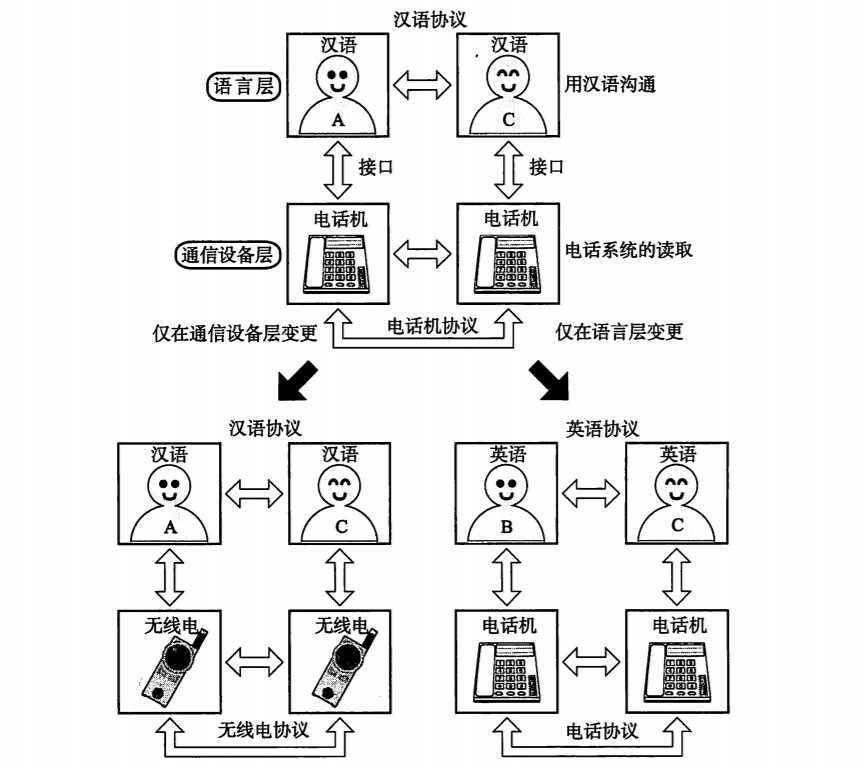
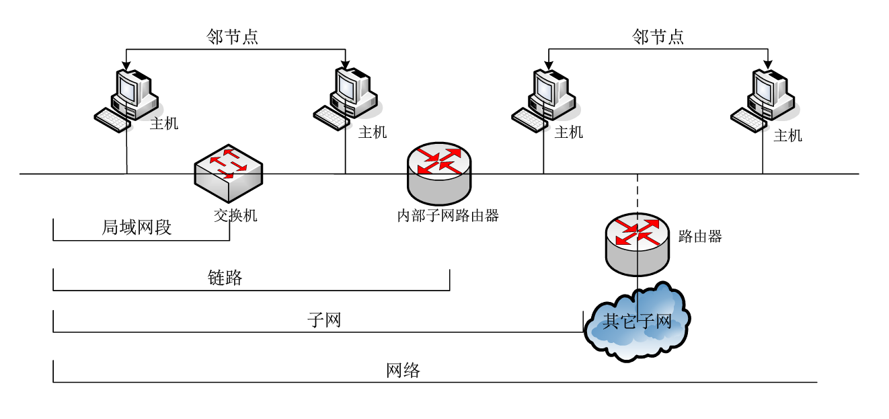
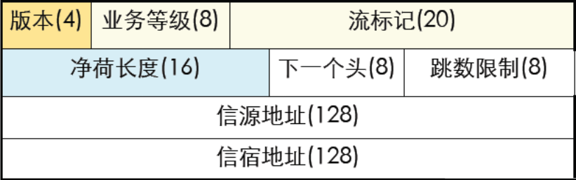
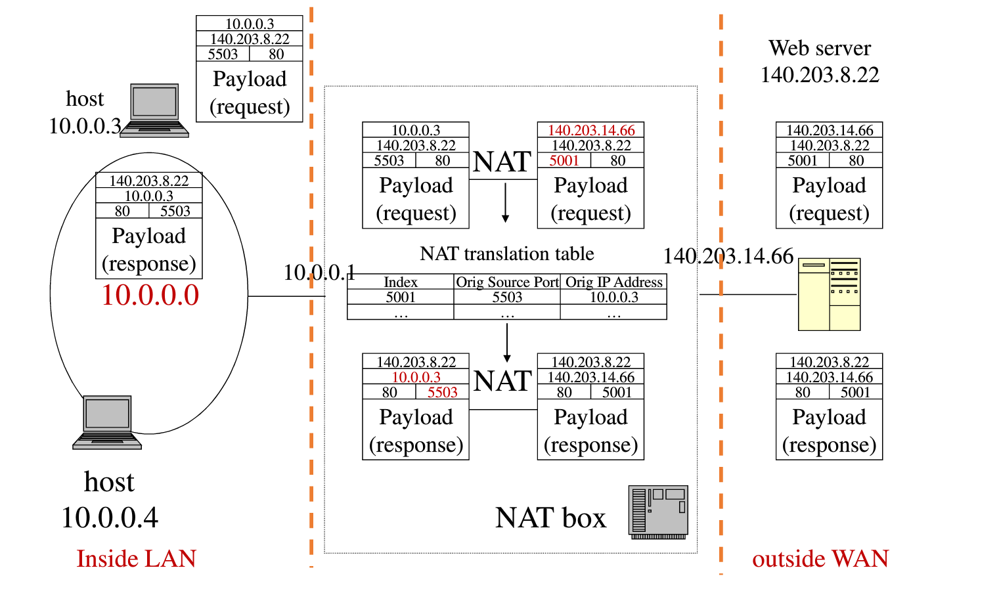
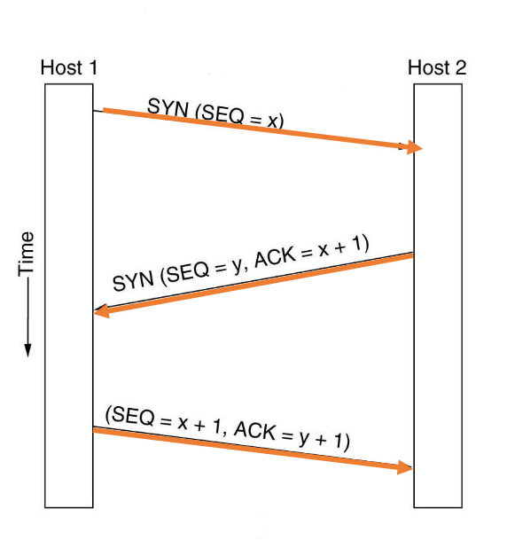
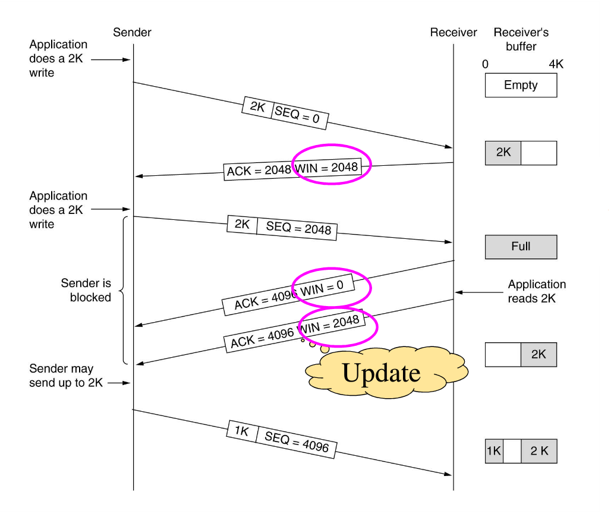

## 第一章 概述

### 1.3 [常用基本概念](https://www.icourse163.org/learn/SCUT-1002700002?tid=1206622278#/learn/content?type=detail&id=1211470282)

#### 拓扑

- **信道**的分布方式
- 常见结构：总线型、星型、环形、树形、网状

#### 协议

一系列规则和约定的规范性描述

> 协议如同人与人的对话
>
> - 将汉语和英语当作“协议”
> - 将聊天当作“通信”
> - 将聊天的内容当作“数据”

#### 网络按规模划分

1. PAN
2. LAN
3. MAN
4. WAN
5. Internet

### 1.4 [参考模型](https://www.icourse163.org/learn/SCUT-1002700002?tid=1206622278#/learn/content?type=detail&id=1211470283&sm=1)

#### 典型分层模型

- OSI七层模型
- **TCP/IP四层模型**

#### TCP/IP参考模型

1. 应用层`Application Layer`
2. 传输层`Transport Layer`
3. 网络层`Internet Layer`
4. 网络接入层`Network Access Layer`

*教程中将网络接入层分为 Data Link Layer 和 Physical Layer*

#### 通过对话理解分层



### 1.5 [参考模型相关概念](https://www.icourse163.org/learn/SCUT-1002700002?tid=1206622278#/learn/content?type=detail&id=1211470284&cid=1214124648)

#### 实体 Entity

- 每层中活动的元素
- 负责完成封装、解封装等基本功能
- 对等实体：Peer Entity，收发双方对应层上的实体

#### 虚拟通信

收发双方的对应层之间有一根直接的通道（虚通道）。沿着虚通道，`PDU`（协议数据单元）从发方到达收方

协议数据单元PDU

## 第二章 物理层

### 2.1 [概述](https://www.icourse163.org/learn/SCUT-1002700002?tid=1206622278#/learn/content?type=detail&id=1211470294&sm=1)

#### 主要功能

- 提供透明的比特流传输
- 不关心其中信息(0、1)，只负责正确搬运

#### 物理层的特性

- 机械特性
- 电气特性
- 功能特性
- 规程特性

#### 信号

- 物理层上数据的传输
- 模拟信号：对应时域的信号的取值是**连续**的
- 数字信号：对应时域的信号的取值是**离散**的
- 码元：不同离散值的基本波形

#### 物理带宽

- 传输过程中振幅**不会明显衰减**的频率范围
- 单位：赫兹
- 取决于介质材料的物理特性

#### 数字带宽

- 单位时间内，流经的信息总量

#### 物理带宽和数字带宽的关系

- 奈奎斯特定理：**无噪声**信道的情况
- 香农定理：**有噪声**信道的情况

### 2.2 [有导向的传输介质](https://www.icourse163.org/learn/SCUT-1002700002?tid=1206622278#/learn/content?type=detail&id=1211470295&cid=1214124676&replay=true)

#### 传输介质

- 引导性：有线
- 非引导性：无线

#### 有线传输介质

- 同轴电缆
- 双绞线
  - 非屏蔽双绞线`UTP`：在**局域网**中使用最多
  - 屏蔽双绞线`STP`
  - 网屏式双绞线
- 光纤
  - 带宽高、距离远，损耗低，不受电磁辐射干扰，易断裂
  - 通常以光缆形式存在

### 2.3 [复用技术](https://www.icourse163.org/learn/SCUT-1002700002?tid=1206622278#/learn/content?type=detail&id=1211470296&cid=1214124680&replay=true)

#### 特点

- 多用户共享同一根信道
- 干线起点共用，干线终点分离

#### 频分多路复用FDM技术

- 波分多路复用WDM技术
- 密集波分多路复用DWDM技术

#### 时分多路复用TDM技术

- 统计时分多路复用STDM技术

#### 码分多路复用CDMA技术

- 广泛用于3G

### 2.4 [调制技术](https://www.icourse163.org/learn/SCUT-1002700002?tid=1206622278#/learn/content?type=detail&id=1211470297&cid=1214124684&replay=true)

#### 调制机制使用信号来传输比特

- 基带传输`Baseband Transmission`
- 通带传输`Passband Transmission`

### 2.5 [公共交换电话网 PSTN](https://www.icourse163.org/learn/SCUT-1002700002?tid=1206622278#/learn/content?type=detail&id=1211470298&sm=1)

#### 主要构成

- 本地回路`Local Loop`
- 干线`Trunks`
- 交换局`Switching Offices`（包含端局）

#### 本地回路

- 传输模拟信号
- 经过**调制解调器**传到端局

#### 调制解调器

- 用于将计算机产生的数字比特流转变为载波输出（模拟信号）
- Modem，又称“猫”

#### 干线

- 多路复用
- 连接交换局（包括端局）的连接
- 通常使用光纤
- 端局里有**编解码器**`codec`
  - 模拟信号数字化/数字信号模拟化
  - 脉冲编码调制PCM

#### 交换局

- 电路交换`Circuit Switching`
  - 建立连接
  - 传数据
  - 拆除连接
  - 分配方式：**提前**分配
  - 收费方式：按**时间**
- 包交换`Packet Switching`（分组交换）
  - 允许包/分组存储在交换局的内存中
  - 独立寻径
  - 乱序送达
  - 分配方式：**按需**分配
  - 收费方式：按**流量**

### 2.6 [物理层设备](https://www.icourse163.org/learn/SCUT-1002700002?tid=1206622278#/learn/content?type=detail&id=1211470299&sm=1)

#### 收发器 Transceiver

- 将一种形式的信号**转变**成另一种形式的信号

- 早期是外设，现在是网卡上的部件
- 负责**收发**信号

#### 中继器 Reapter

- **再生信号**：去噪、放大
- 让线缆延申更远，突破UTP的限制
- **不能过滤**流量

#### 集线器 Hub

- 多端口的中继器
- 再生信号
- 不能过滤流量
- 早期以太网，集线器作为星型拓扑结构的中心，进行`广播`（从除了来的那个端口外所有其他端口转发出去）

#### 冲突

- 更多的用户争抢共享资源
- 冲突域增大，冲突的可能性变大，网络性能下降
- 使用了中继器和集线器，实际上是扩大了冲突域

#### 物理层设备

- 都是**傻瓜设备**，不具备过滤流量的功能
- **很少再使用**中继器、集线器（除光中继器以外）

## 第三章 数据链路层

### 3.1 [概述](https://www.icourse163.org/learn/SCUT-1002700002?tid=1206622278#/learn/content?type=detail&id=1211470309&sm=1)

#### 负责

- 差错检测和控制
- 流量控制
  - 基于速率
  - **基于反馈**

#### 成帧

- 字符计数法
  - 每帧的**第一个字段**，标识帧的长度
  - 一旦出错，后续的都出错
- 字节填充的标志字节法
  - 用**帧界**，特殊的一个字节，标记帧的开始和结束
  - 传输的数据中若是出现帧界，则在帧界前加上**转义符**
  - 帧，按**字节**为单位传递，**任意比特数**的帧不适用，必须是**8位**整数倍
- 比特填充的标志比特法
  - 以`01111110`为帧标记
  - 如果帧的内容中也出现了与帧标记相同的位串，则在传输中变成`011111010`
  - 5个`1`以后一定会插入一个`0`
- 物理层编码违例法
  - 帧界：冗余信号

#### 作用

- DataLink Layer 位于物理层之上，网络层之下
- 提供有效的、可靠的**帧**传输

### 3.2 [差错处理概述](https://www.icourse163.org/learn/SCUT-1002700002?tid=1206622278#/learn/content?type=detail&id=1211470310&cid=1214124723&replay=true)

#### 错误的处理

- 纠错：恢复出正确的数据
- 检错：仅仅检查出错误，往往伴随重传

#### 错误的种类

- 单个错误：分散在各个数据块
- 突发错误：整个块都是错误

#### 纠错码

- 前向纠错技术
- 有线网中极少采用，主要用于**无线网**

#### 检错码

- **局域网**中主要采用

#### 码字

- 包含数据位、检验位的 n 位单元（模式）
- 海明距离
  - 两个码字之间，不同位的数目
  - 可用`异或`计算，运算结果中`1`的个数
  - 如果海明距离为`d`，则一个码字需要发生`d`个1位错误才能变成另一个码字
  - 一组码字的海明距离：任意两个码字的海明距离中的**最小值**
- 海明距离为`d+1`的编码能**检测**出`d`位的差错
- 海明距离为`2d+1`的编码能**纠正**`d`位的差错
- 海明距离**越大**，纠错能力**越强**，合法码字减少，传输效率**降低**

### 3.3 [纠1位错的海明码](https://www.icourse163.org/learn/SCUT-1002700002?tid=1206622278#/learn/content?type=detail&id=1211470311&sm=1)

#### 冗余位和数据位的关系
- 冗余位：`r`
- 数据位：`m`
- 传输：`n=m+r`
- (m+r+1) ≤ 2<sup>r</sup>

#### 海明纠错码

- `n`从左到右编号
- 校验位：编号位为`2`的次幂
- 数据位：剩下的位
- 校验位的依据为包括自身在内的一些位的集合的奇偶值(采用奇校验/偶校验)

#### 校验位的决定

- 将某一位数据位的编号展开成`2`的乘幂的和，则每一位所对应的位即为该数据位的校验位

- 如：m = 7，r = 4

  |                 |  B1  |  B2  |  B3  |  B4  |  B5  |  B6  |  B7  |  B8  |  B9  | B10  | B11  |
  | :-------------: | :--: | :--: | :--: | :--: | :--: | :--: | :--: | :--: | :--: | :--: | :--: |
  |                 | `P1` | `P2` |  D1  | `P3` |  D2  |  D3  |  D4  | `P4` |  D5  |  D6  |  D7  |
  | 1=2<sup>0</sup> |  ✔   |      |  ✔   |      |  ✔   |      |  ✔   |      |  ✔   |      |  ✔   |
  | 2=2<sup>1</sup> |      |  ✔   |  ✔   |      |      |  ✔   |  ✔   |      |      |  ✔   |  ✔   |
  | 4=2<sup>0</sup> |      |      |      |  ✔   |  ✔   |  ✔   |  ✔   |      |      |      |      |
  | 8=2<sup>3</sup> |      |      |      |      |      |      |      |  ✔   |  ✔   |  ✔   |  ✔   |
  

#### 编码

- 原数据：`1001000`，m = 7，r = 4，n = 11
- 使用`偶校验`


P3 = 只有一个`1`，校验码为`1`

|        |  B1  |  B2  |  B3  |  B4  |  B5  |  B6  |  B7  |  B8  |  B9  | B10  | B11  |
| :----: | :--: | :--: | :--: | :--: | :--: | :--: | :--: | :--: | :--: | :--: | :--: |
|        | `P1` | `P2` |  D1  | `P3` |  D2  |  D3  |  D4  | `P4` |  D5  |  D6  |  D7  |
| 信息码 |  -   |  -   |  1   |  -   |  0   |  0   |  1   |  -   |  0   |  0   |  0   |
| 检验位 | `0`  | `0`  |  -   | `1`  |  -   |  -   |  -   | `0`  |  -   |  -   |  -   |
| 海明码 | `0`  | `0`  |  1   | `1`  |  0   |  0   |  1   | `0`  |  0   |  0   |  0   |

#### 纠错

- 对每一位校验位进行校验
- 出错的数据位 = 出错的校验位的和

### 3.4 [检错码](https://www.icourse163.org/learn/SCUT-1002700002?tid=1206622278#/learn/content?type=detail&id=1211470312&cid=1214124731)

#### 分类

- 奇偶校验
- 互联网校验
- 循环冗余校验

#### 循环冗余检错码CRC

- `k`位的帧 = `k-1`次的多项式，最末端视作`0`次
- 例：1011001 => X<sup>6</sup>+X<sup>4</sup>+X<sup>3</sup>+X<sup>0</sup>

- **生成多项式**：G(x)，`r`阶
- m位帧的生成多项式：m > r，M(x) > G(x)
- 发方
  - X<sup>r</sup>M(x)/G(x) = Q(x)+R(x)
  - (X<sup>r</sup>M(x)-R(x))/G(x) = Q(x)
  - 编码后的码字：X<sup>r</sup>M(x)-R(x)
- 收方
  - (X<sup>r</sup>M(x)-R(x))**%**G(x)
  - 整除，说明接收正确

### 3.5 [基本数据链路层协议](https://www.icourse163.org/learn/SCUT-1002700002?tid=1206622278#/learn/content?type=detail&id=1211470313&sm=1)

#### 无限制的单工协议

- 假设
  - 数据单向传送
  - 收发双方的网络层都处于就绪状态
  - 处理时间忽略不计
  - 无限空间
  - 完美通道：信道不损坏、不丢帧
- 乌托邦协议

#### 单工停/等协议

- **半双工的协议**

- 取消了收方无限空间的假设
- 收方收到数据后，如果有能力处理，回发一个`哑帧`给发方
- 发方收到`哑帧`，可以再次发送下一帧数据

#### 有噪声信道的单工协议

- **肯定确认重传 PAR**

- 取消了完美信道、收方无限空间的假设
- 特点：`确认帧`，`定时器`
- 收方收到的帧通过校验，向发方发送`确认帧`
- 发方收到了`确认帧`，才会发送下一帧
- 发方在发送数据以后，启动一个`定时器`，期望在超期前，收到`确认帧`
- 发方在定时器超期以后，`重传帧`
- 区别帧和重传帧：帧的序号

#### 提高效率

- 全双工：不再区别收方、发方，可以`互发`数据
- 捎带确认：确认帧可以稍带到发送给对方的数据里
  - 外发的数据帧(s.ack)
  - `捎带确认`的定时器，超期则单独发送确认帧
- 批量发送：利用`停/等`的空闲时间

### 3.6 [滑窗协议](https://www.icourse163.org/learn/SCUT-1002700002?tid=1206622278#/learn/content?type=detail&id=1211470314&cid=1214124739&replay=true)

#### 两个窗口

- 发送窗口：已经发送，未确认
- 接收窗口：期望被接收的帧的序列号

#### 滑窗技术的原理

- 窗口数：1
- 帧的序号`seq`：只用一个比特，0/1，交替出现
- 确认帧`ack`：指对面发送的seq

#### 窗口滑动的条件

- 接收方
  - 收到帧的序列号，是期待接收的帧号
  - `frame_expected`+1
- 发送方
  - `ack`(收到的确认帧) = `next_frame_to_send`(曾经发出的帧号) 
  - `next_frame_to_send`+1

#### 重复帧的问题

在接收到确认帧之前，定时器超时，重新发送帧给对面，对面发现帧重复，再次发送确认帧回来。导致重复帧很多，但是正常工作。

#### 合适的窗口数 W

- 信道容量：一帧发出到目的期间，信道上能够容纳的帧的数量
- **带宽-延迟积**：`B×D`
- 窗口值：`2DB+1`

### 3.7 [回退N帧](https://www.icourse163.org/learn/SCUT-1002700002?tid=1206622278#/learn/content?type=detail&id=1211470315&sm=1)

- 连续的发送好多数据帧，其中一个帧出错，则丢弃错帧及后续的帧，后续`全部重传`
- 需要发送方付出更多的缓存代价
- 适合出错率较少的高速信道

#### 发送方的重传策略

- 出错帧以及所有的后续帧，缓存在发送窗口中
- 发送方连续发送至发送窗口满
- 对帧编号，**未被确认的帧缓存**
- 收到确认，释放确认帧所占用的缓冲区，滑动发送窗口
- 定时器超时，回退到超时的帧，顺序重传**最后被确认帧**以后 的缓存区中缓存的帧

#### 接收方

- 每收到**期望**的正确帧，上交网络层，回送确认

- 收到出错帧，丢弃，`回送`对接受的最后正确帧的确认(无法使用捎带确认)

#### 累计确认

- 发送seq = 0~7，回发ack = 7
- 暗含着对第7帧，及其之前所有的帧的确认

- 发送窗口
  - W ≤ MAX_SEQ
  - 防止出错时，无法区分`ack`是哪一个窗口的
  - 即每次发送的窗口的seq不能顺序排列相同，如：0~7，0~7，应为0~7，8~6，7~5

- 接收窗口：W = 1

### 3.8 [选择性重传](https://www.icourse163.org/learn/SCUT-1002700002?tid=1206622278#/learn/content?type=detail&id=1211470316&sm=1)

- 适用于通信环境质量糟糕，出错率较大的情况

#### 接收方

- 正常接收：上交网络层，回送确认`ack`，滑动接收窗口

- 丢弃出错帧，如果后续帧正确，`缓存`下来，回送对接收的**最后正确帧**的确认
- 收到重传帧：**将缓存帧排序上交**，回送确认`ack`，滑动接收窗口
- 避免等待发送方的出错帧超时，接收方在遇到出错帧时，使用`nak`（Negative-Acknowledgment)

#### 发送方

- 正常发送：对帧编号，等待确认的帧**缓存**
- 收到确认：释放确认帧所占缓冲区，滑动发送窗口
- 出错/超时：重传缓存的最后被确认帧**的后面**那一帧

#### 滑动窗口长度 W 的选择

- 发送窗口：W = (MAX_SEQ + 1)/2
- 避免**前后**两个窗口里的序列号出现**重复**
- 第一次回送的确认帧，如果丢失，发送方超时重新发送，此时如果接收方`期待`的帧里的序列号(后一个窗口)和发送方`重发`的帧里的序列号(前一个窗口）`重复`，则会出错
- 即：重传帧被当作新帧被接收

#### 三种协议的窗口大小

|                | 协议4：滑动窗口 | 协议5：回退N帧 | 协议6：选择性重传 |
| :------------: | :-------------: | :------------: | :---------------: |
| 发送窗口`SWnd` |      (0,1]      |  (0,MAX_SEQ]   |     [0,RWnd]      |
| 接收窗口`RWnd` |        1        |       1        |  (MAX_SEQ + 1)/2  |

##  第四章 介质访问控制子层

### 4.1 [MAC子层概述](https://www.icourse163.org/learn/SCUT-1002700002?tid=1206622278#/learn/content?type=detail&id=1211470325&sm=1)

#### Data Link Layer

- Logical Link Control Sublayer `LLC`
- Media Access Control Sublayer `MAC`

#### MAC

- 局域网里采用的数据通信方式：广播，`共享`传输介质
- 共享信道：广播信道/多路访问信道
- 介质的多路访问控制：确定下一个使用者（使用共享信道），即：`信道的分配`

#### 信道的分配

- 静态分配
  - **预先**分配给用户
  - 不同用户使用情况不同
  - 例：FDN，TDN（见2.3）
  - 适用
    - 用户数量**少**，用户**固定**
    - 通信量**大**，且流量**稳定**
- 动态分配
  - 信道开放，**临时动态**地分配
  - 没有预分配

#### 多路访问协议 Multiple Access Protocol

- 随机访问协议
  - 用户互相争抢信道
  - ALOHA协议，CSMA协议，**CSMA/CD协议**(以太网采用)

- 受控访问协议
  - 不会产生冲突

### 4.2 [ALOHA协议](https://www.icourse163.org/learn/SCUT-1002700002?tid=1206622278#/learn/content?type=detail&id=1211470326&sm=1)

#### 性能分析

- 吞吐率`Throughout`S
  - 在一个帧时内，发送成功的**平均帧数**
  - 0 < S < 1
  - 信道利用率100% -> S=1
- 运载负载`Carried Load`G
  - 一个帧时内，**所有**通信站总共发送的帧的**平均值**（包括原发，重发）
  - G ≥ S => 有冲突
  - G = S => 无冲突
  - G > 1 => 冲突频繁，产生大量重传
- P<sub>0</sub>
  - 一帧发送成功/未发生冲突的概率
  - **发送成功的帧**在**全部已发送帧**的总数中的比例

- S = G × P<sub>0</sub>

#### 纯ALOHA协议

- 冲突危险期：2T
- 信道利用率：18.4%
- 一旦产生新帧，`立即发送`，不顾是否有用户正在发送

#### 分隙ALOHA协议

- 冲突危险期：T

- 发送行为必须在`时隙的开始`，一旦发送开始时没有冲突，则该帧将成功发送

### 4.3 [CSMA协议](https://www.icourse163.org/learn/SCUT-1002700002?tid=1206622278#/learn/content?type=detail&id=1211470327&cid=1214124776&replay=true)

#### 载波监听多路访问协议

- Carrier Sense Multiple Access

- 改进的ALOHA协议
- `先听后发`

#### 非持续式CSMA

- 侦听到介质空闲，开始发送帧
- 侦听到介质正忙，等待一个`随机`的时间
- 如果等待的时间内，介质上没有数据传送，则造成浪费

#### 持续式CSMA [1-持续]

- 侦听到介质空闲，开始发送帧
- 侦听到介质正忙，`持续`侦听
- 如果发生`冲突`，等待一个`随机`分布的时间
- 如果`两个以上`的站同时持续侦听，一旦介质空闲，**必定**会冲突

#### 持续式CSMA [P-持续]

- 侦听到介质空闲，`P`的概率发送数据，`1-P`的概率延迟一个时间发送
- 侦听到介质正忙，`持续`侦听

#### 传播延迟对载波侦听的影响

工作站A发送的帧还没到达工作站B，工作站B的侦听结果为：介质空闲，发送帧。因此，A、B工作站的帧发生冲突

#### 冲突窗口

- 检测到冲突的时间`上限`
- = 两个最远`工作站`之间的传输时间 × 2

#### CSMA/CD协议 [1-持续]

- 冲突检测`Collision Detection`
- `先听后发，边发边听`

- 侦听到介质空闲，开始发送帧
- 侦听到介质正忙，`持续`侦听，一旦空闲立即发送
- 侦听到发送的帧出现冲突，`等待`一个`随机`分布的时间，再侦听
- 要求所有的工作站，在发送的时候，也侦听自己的信号，侦听到的和发送的不一致，则出现冲突
- 在**半双工的以太网**里使用

### 4.4 [以太网概述](https://www.icourse163.org/learn/SCUT-1002700002?tid=1206622278#/learn/content?type=detail&id=1211470328&sm=1)

#### Ethernet

- 位于OSI参考模型的`Physical Layer`和`Data Link Layer`
- 经典以太网(3M~10Mbps，不太常用)
- **交换式以太网**

- 是CSMA/CD的`实现`
- `二进制指数回退算法`，计算冲突后的延迟时间

### 4.5 [以太网的帧格式](https://www.icourse163.org/learn/SCUT-1002700002?tid=1206622278#/learn/content?type=detail&id=1211470329&sm=1)

#### MAC地址

- 物理地址，全球唯一
- `48`位，`6`Byte，`12`个16进制数，分隔成`6`组
- 前24位OUI，向IEEE申请
- 烧在设备网卡的ROM里

#### DIX以太网帧的结构

| 先导字段 | 帧开始符 | 目的地址 | 源地址 | 类型  |    数据     | 校验和（CRC） |
| :------: | :------: | :------: | :----: | :---: | :---------: | :-----------: |
|  62bit   |   2bit   |  6Byte   | 6Byte  | 2Byte | 46~1500Byte |     4Byte     |

- 前导码+起始符 => 8Byte，1010...1010
- 目的地址，源地址都是`MAC地址`

- 类型字段，指定了上层网络层的`协议`

- 数据字段，搭载LLC的数据，如果少于46个字节，则用`填充符`填充
- 校验和，CRC循环冗余校验，校验除了前导码之外的字段

### 4.6 [二层交换的基本原理](https://www.icourse163.org/learn/SCUT-1002700002?tid=1206622278#/learn/content?type=detail&id=1211470330&sm=1)

- 网桥/交换机，连接LAN
- 网桥工作在数据链路层，检查MAC地址转发帧
- 隔离了冲突，是冲突域的边界

#### 透明网桥

- 通过透明网桥`Transparent Bridges`将多个LAN连接起来，**硬件**和**软件**不需要做变化
- 工作在混杂模式`Promiscuous Mode`，接收**所有**的帧
- 当一个帧到达时，网桥必须做出**丢弃**`discard`/**转发**`forward`的决策

- 通过网桥内部的**地址表**`Hash Table`中查找**目的MAC地址**做出`决策`

#### 地址表

- 网桥收到的帧，目的地址未知（表中查无），**广播**`flooding`给所有**其他**的端口
- 逆向学习`Backward Learning`：（**源**地址，端口），写入MAC地址表
- 网桥**适应**拓扑的变化
  - 信息对写入MAC地址表时，必须打上`时戳`
  - 到达网桥的帧如果已经记录，更新记录，并更新时戳
  - **周期性**的扫描MAC地址表：`删除`超时的记录

#### 网桥的工作原理

- 目的端口 = 源端口，丢弃
- 目的端口 ≠ 源端口，转发
- 目的端口 => 未知，广播

### 4.7 [生成树协议](https://www.icourse163.org/learn/SCUT-1002700002?tid=1206622278#/learn/content?type=detail&id=1211470331&cid=1214124792&replay=true)

- 为了**可靠性**，采用`冗余拓扑`
- 冗余造成环路，出现问题
  - 多帧传送
  - 广播风暴
  - MAC地址库不稳定
- **生成树算法**`Spanning Tree Protocol`打断环路，维持逻辑上的`无环路`
  - 每个网络有一个`根网桥`
  - 每一个网桥有一个`根端口`
  - 每一个网段有一个`指定端口`
  - 剩下的`非指定端口`不被使用
- 产生的路径可能**非最优**
- 当逻辑STP树上某点出现故障，`非指定端口`将会重新启用

### 4.8 [虚拟局域网](https://www.icourse163.org/learn/SCUT-1002700002?tid=1206622278#/learn/content?type=detail&id=1211470332&cid=1214124796&replay=true)

- 一组逻辑上的设备或用户，不考虑地理位置
- 特性等同于物理LAN
- `帧表记法`可以让帧穿过交换机的`干线`

#### VLAN的实现

- 基于MAC地址
- 基于三层协议
- 基于端口

### 4.9 [二层设备](https://www.icourse163.org/learn/SCUT-1002700002?tid=1206622278#/learn/content?type=detail&id=1211470333&sm=1)

#### 二层设备（数据链路层）

- 网卡
- 网桥
- 交换机

#### 网卡 NIC

- `Network Interface Card`
- 为主机提供介质访问
- 负责和上层通信（LLC）
- 提供一个独特的地址标识符 => MAC地址
- 为传输比特流打包（成帧的一部分）

#### 网桥

- 连接不同的`LAN段`
- `过滤`部分交通流量，减少冲突，改善`网络性能`，减少冲突
- 以LAN段`分流`交通，基于MAC地址过滤

#### 交换机

- 多端口的网桥
- 替换集线器，作星型拓扑结构的中心
- 交换速度`高于`网桥
- 支持VLAN

#### 交换机的交换模式

- 存储转发
  - 接收整个帧，计算检查校验和
  - 延迟大，出错率小
- 直通交换
  - 读取到目的MAC地址后，立即开始做出决策
  - 延迟小，出错率高
- 无分片交换
  - 不处理/转发`残帧`（~~小于64字节~~）

## 第五章 网络层

### 5.1 [网络层概述](https://www.icourse163.org/learn/SCUT-1002700002?tid=1206622278#/learn/content?type=detail&id=1211470342&sm=1)

#### 功能

将`源端`产生的**数据包**/**数据分组**，一路送达`目的机`

- 信息封装
- 目的机的识别
- 找到`路由`（源机->目的机的路径）

#### 被路由的协议

IP协议

- IP地址：定位目的机
- IP分组：信息的封装
- IPv6协议：新一代IP协议

#### 路由选择协议

找到源机和目的机之间的**最优路径**

- 距离矢量路由选择协议
- 链路状态路由选择协议

#### 源机和目的机之间的网络

|                       |               数据报子网               |     虚电路子网     |
| :-------------------: | :------------------------------------: | :----------------: |
|         电路          |               不需要建立               |     一定要建立     |
|         分组          | 包含完整的源地址和目的地址信息独立寻径 | 包含很短的一个标号 |
|         路由          |         不需要保留任何连接状态         |  都要保留连接状态  |
|  路由器<br/>失效影响  |              基本没有影响              | 连接/数据传输中断  |
| 服务质量<br/>拥塞控制 |                很难实现                |      容易实现      |

### 5.2 [IP地址](https://www.icourse163.org/learn/SCUT-1002700002?tid=1206622278#/learn/content?type=detail&id=1211470343&cid=1214124837&replay=true)

- 提供一种**尽力而为**`best-effort`地把数据从源端传输到接收方的方法
- 为路由提供路由所需要的信息
- IP协议 = 被路由协议

#### IP地址

- 32位二进制位

- 点分十进制

  - 32 => 4×8

  - 每个8位组，二进制 => 十进制，0~255

  - Example：IP地址体现了层次性

    [.... ....] Internet

    [130.1.0.0] 网络

    [130.1.1.0] 子网1

    [130.1.1.1] 主机

#### IP地址的两层结构

- 网络部分：0~15位
- 主机部分：16~31位

#### A类地址

**0xxxxxxx**.xxxxxxxx.xxxxxxxx.xxxxxxxx

- 1字节标识`网络地址`，2、3、4字节标识`主机地址`
- 第1个字节 => [0,127]
- 每个A类地址/A类网络，容纳 **2<sup>24</sup>-2** 台主机
  - 减去的2：用于广播地址和网络地址

#### B类地址

**10xxxxxx**.**xxxxxxxx**.xxxxxxxx.xxxxxxxx

- 1、2字节标识`网络地址`，3、4字节标识`主机地址`
- 第1个字节 => [128,191]
- 每个B类地址/B类网络，容纳 **2<sup>16</sup>-2** 台主机

#### C类地址

**110xxxxx**.**xxxxxxxx**.**xxxxxxxx**.xxxxxxxx

- 1、2、3字节标识`网络地址`，4字节标识`主机地址`
- 第1个字节 => [192,223]
- 每个C类地址/C类网络，容纳 **2<sup>8</sup>-2** 台主机

#### 保留的IP地址

不能分配给某个接口/某个主机使用

- D类：1110xxxx.xxxxxxxx.xxxxxxxx.xxxxxxxx
- E类：11110xxx.xxxxxxxx.xxxxxxxx.xxxxxxxx

- 网络地址：xxxxxxxx.xxxxxxxx.00000000.00000000
- 广播地址：xxxxxxxx.xxxxxxxx.11111111.11111111
- 0.0.0.0
  - 表示：这个主机、这个网络
  - 在路由表中，默认路由的目的地址
- 255.255.255.255
  - 泛洪广播地址
- 127.0.0.0
  - 环回地址`Lookback Network`
  - 127.0.0.1 => localhost

- 169.254.0.0
  - 非正常地址
  - 不能对外正常通信

### 5.3 [子网规划](https://www.icourse163.org/learn/SCUT-1002700002?tid=1206622278#/learn/content?type=detail&id=1211470344&cid=1214124841&replay=true)

将大网络分割成小网络

#### 主路由器

- *边界路由器*

- 负责和外部联系
- 了解内部网络结构的机制：**子网掩码**

#### 子网掩码

- 决定分组往哪个子网转发
- 点分十进制表示 => 连续的`1`(网络位) + 连续的`0`(主机位)

- 按位`与`操作
  - 目的IP地址 AND 子网掩码 = 目的网络地址
  - 按位操作后，主机位全为`0`
- A、B、C类的缺省

|                |    A类    |     B类     |      C类      |
| :------------: | :-------: | :---------: | :-----------: |
| 点分十进制表示 | 255.0.0.0 | 255.255.0.0 | 255.255.255.0 |
|  网络前缀表示  |    /8     |     /16     |      /24      |

#### 子网位

- 从IP地址的主机部分借位
  - 从高位开始借
  - 至少保留2位

- Example：192.168.1.0/24，主机域借2位作为子网位

  子网的网络地址：

  192.168.1.**00** 000000 => 192.168.1.**0/26**

  192.168.1.**01** 000000 => 192.168.1.**64/26**

  192.168.1.**10** 000000 => 192.168.1.**128/26**

  192.168.1.**11** 000000 => 192.168.1.**192/26**

  - 第4个子网的网络地址：192.168.1.10 000000 => 192.168.1.64
  - 第4个子网的广播地址：192.168.1.10 111111 => 192.168.1.127

### 5.4 [IP寻址](https://www.icourse163.org/learn/SCUT-1002700002?tid=1206622278#/learn/content?type=detail&id=1211470345&cid=1214124845&replay=true)

根据目的IP地址，找到**目的网络**

#### 路由器

- 执行IP寻址的主要设备

- 1个路由器`Router` = 1跳`Hop`

- 收到一个分组

  - 打开分组
    - 提取到`目的IP地址`

  - 确定网络，查找路由表

    - 目的IP地址和子网掩码按位与运算，得到`目的网络`

    - 用目的网络查找路由表

  - 重新封装，转发`next hop`

- 到达最后一个网络`目的网络`，MAC寻址（交换机执行）

|      不同       |  MAC地址   |   IP地址   |
| :-------------: | :--------: | :--------: |
|  网络范围使用   |  小型网络  |   互联网   |
| 依赖的地址结构  |  平面地址  | 结构化地址 |
| 所处OSI模型的层 | 数据链路层 |   网络层   |
|   地址的格式    |  十六进制  | 点分十进制 |

### 5.5 [IP分组](https://www.icourse163.org/learn/SCUT-1002700002?tid=1206622278#/learn/content?type=detail&id=1211470346&cid=1214124849&replay=true)

- IP分组包含12个基本的字段和选项字段
- IP分组分为：头部、数据

#### 报头长度

- 大小：4bit
- 单位：`4Byte`
- 0101 ~ 1111

#### 数据报总长

- 大小：16bit
- 单位：`Byte`

#### 生存时间 TTL

- 大小：8bit
- 单位：`hop`
- 每经过一个路由器，TTL-1
- 当TTL-1=0时，路由器丢弃该分组，向源发回一个超时消息
- 防止分组在网络无限循环

#### 用户协议

- 大小：8bit
- 指明传输层采用的协议
  - UDP：17
  - TCP：6

#### 目的IP地址

- 大小：32bit

### 5.6 [IPv6概述](https://www.icourse163.org/learn/SCUT-1002700002?tid=1206622278#/learn/content?type=detail&id=1211470347&sm=1)

#### IPv4存在问题

- 地址数
- 端到端模式收到破坏
  - 地址数匮乏，使用了私人地址
  - 私人地址不具有唯一性，和互联网通讯，必须进行转换
  - NAT转换器
- 配置复杂
- 安全问题
- 路由表膨胀
  - 增加了每一个分组的延迟
- QoS和性能问题

#### IPv6的目标

- 支持几十亿台主机
- 缩减路由表的规模
- 简化协议，路由器处理分组更快
- 更好的安全性
- ... ...

### 5.7 [IPv6地址](https://www.icourse163.org/learn/SCUT-1002700002?tid=1206622278#/learn/content?type=detail&id=1211470348&sm=1)

#### 基本概念

- 局域网段：LAN段，**最小单位**。`交换机`一个接口下的这一条链路
- 链路：`路由器`一个接口下的，若干个局域网段构成的
- 邻接点：一条链路上的两台主机



#### 冒分十六进制

- IPv6地址：128位（v4仅有32位）
- 128 => 8组 × 16位
- 简化规则
  - 忽略前导0
  - 省略全0 => 双冒号，一个地址里最多只能出现一次双冒号

#### IPv6地址分类

- 单播地址`Unicast Address`
  - 一对一通信
- 组播地址`Multicast Address`
  - 特定组内通信
- 任播地址`Anycast Address`
  - 特定组内，任意一台计算机

#### 特殊地址

- 未指定
  - 二进制前缀：000...0（128bit）
  - IPv6：`::/128`
  - 一台设备未正式的获得地址时，以此代替
  - 路由表中**目的网络**，表示默认路由
- 环回地址
  - 二进制前缀：000...1（128bit）
  - IPv6：`::1/128`
  - 类似IPv4中的127.0.0.1
- 组播
  - 二进制前缀：11111111
  - IPv6：`FF00::/8`
- 链路本地地址
  - 二进制前缀：1111111010
  - IPv6：`FE80::/10`
  - 属于单播地址
- 网点本地地址
  - 二进制前缀：1111111111
  - IPv6：`FEC0::/10`

#### 链路本地地址

属于单播地址

- 用在单一的链路上
- 如果一个分组的目的地址||源地址是链路本地地址，分组不回转发到其他链路
- IPv6设备启动时，首先生成一个链路本地地址，此时就可以和链路上的其他节点通信
- **FE80:0:0:0** + EUI64位地址（合128bit）
- EUI64地址
  - 将MAC地址转化成二进制的48位
  - 在前24位和后24位中间加上**16位**的`11111111 11111110`
  - 从高位起的**第7位**，0 => 1（U/L位：用于确定该地址是全局管理的还是本地管理的）

#### 可聚合全球单播地址

| 3bit |        13bit         |      8bit      |        24bit         |         16bit          |    64bit    |
| :--: | :------------------: | :------------: | :------------------: | :--------------------: | :---------: |
| 001  | TLA<br/>顶级聚类地址 | RES<br/>保留位 | NLA<br/>次级聚类地址 | SLA<br/>站点级聚类地址 | InterfaceID |

- SLA可用作子网规划
- 如果主机可以和默认网关通讯，就可以从默认网关获取全球IPv6地址的前缀
- 默认网关：和主机**直接相连**的路由器
- 前缀 + InterfaceID => 全球单播地址

### 5.8 [IPv6分组](https://www.icourse163.org/learn/SCUT-1002700002?tid=1206622278#/learn/content?type=detail&id=1211470349&sm=1)

#### IPv6的报头



- 协议版本（4bit）：0110 => IPv6
- 流标记（20bit）：为源端和目的端提供了建立`伪连接`的方式
- 净荷长度（16bit）：固定头之后的字节数
- **下一个头**`Next Header`（8位）
  - 指明当前头之后，扩展头的类型
  - 若当前头为最后一个头，则用于指明上层传输层指定的用户协议（与IPv4中相同）

- 跳数限制`Hop Limit`：等同于IPv4中的TTL

#### 与IPv4的不同

- 删除校验和

  - 上层传输层和下层数据链路层都有自己的校验和

- 删除分段/分片

  - 源端在一开始必须知道全部路径/网络的`最小MTU`
  - MTU：最大传输单元，Maximum Transmission Unit

  - PMTU算法

### 5.9 [IPv6过渡技术](https://www.icourse163.org/learn/SCUT-1002700002?tid=1206622278#/learn/content?type=detail&id=1211470350&sm=1)

- 双栈
- 隧道
- 地址转换

### 5.10 [路由表](https://www.icourse163.org/learn/SCUT-1002700002?tid=1206622278#/learn/content?type=detail&id=1211470351&cid=1214124869&replay=true)

#### 路由表的结构

- 目的网络/子网掩码
- 路径代价
- 下一跳（网关）
- 转出接口
- ...

#### 路由信息

|    直连路由    |     静态路由     |   动态路由   |
| :------------: | :--------------: | :----------: |
| 路由器学习感知 | 管理人员人工配置 | 路由选择协议 |

- 直连路由
  - 路由器开启了接口，**自动发现**接口对应的子网，并记录到路由表
- 静态路由
  - 常见的静态路由：缺省/**默认路由**
  - 默认路由
    - 避免错误丢包
    - 缩减路由表的规模
    - 减少路由器的运行负担
  - 优点
    - 适用小型网络
    - 安全，不会发送通告
    - 稳定，通过同一路径总是到达同一网络
    - 不需要CPU、RAM、带宽等开销
  - 缺点
    - 网络规模增大，配置复杂性增长
    - 人工更新维护繁琐

- **动态路由**（多数）
  - 由`路由选择协议`动态地建立、更新和维护的路由
  - 适合大型网络
  - 不受网络规模的限制
  - 自动更新、维护路由信息
  - 量度路径最优
    - 跳数
    - 带宽
    - ...

### 5.11 [距离矢量路由选择协议](https://www.icourse163.org/learn/SCUT-1002700002?tid=1206622278#/learn/content?type=detail&id=1211470352&cid=1214124873&replay=true)

#### Distance Vector

- 常用于**小型**网络
- 典型DV算法：路由选择信息协议
  - RIP`Routeing Information Protocol`
  - 早期互联网使用
- 矢量/向量：一个有序数组，`n`维向量中存了`n`个数，有先后次序之分。

#### DV的工作原理

- 每个路由器`维护`两个矢量，D<sub>i</sub>和S<sub>i</sub>
  - D<sub>i</sub>：该路由器到所有其他路由器的距离，{ d<sub>i1</sub>，d<sub>i2</sub>，... ... ，d<sub>in</sub>}
  - S<sub>i</sub>：该路由器到所有其他路由器的下一跳，{ s<sub>i1</sub>，s<sub>i2</sub>，... ... ，s<sub>in</sub>}
  - d<sub>i1</sub>：从`节点i`到`节点1`的度量/代价
  - s<sub>i1</sub>：从`节点i`到`节点1`的最优路几个上的下一跳
  - n：网络中路由器的个数

- 邻居路由器`交换`路由信息（矢量信息）
- 每个路由器根据收到的路由信息，`更新`路由表

#### DV算法的特点

- 优点
  - 简单
- 缺点
  - 交换信息大
  - 路由信息传播缓慢，可能导致路径信息不一致
  - 不适合大型网络

### 5.12 [路由选择信息协议 RIP](https://www.icourse163.org/learn/SCUT-1002700002?tid=1206622278#/learn/content?type=detail&id=1211470353&cid=1214124877&replay=true)

#### 特点

- 采用`跳数`作为S<sub>i</sub>的**量度**
- 当量度超过15跳，目的网络即作`不可达`
  - 解决`路由环`问题
  - 完全相信邻居路由器，导致的路由环/无穷计数问题
- 30秒交换一次路由信息

### 5.14 [链路状态路由选择](https://www.icourse163.org/learn/SCUT-1002700002?tid=1206622278#/learn/content?type=detail&id=1211470361&sm=1)

Link State Routing

#### 主要思路

- 发现
- 设置
- 构造
- 发送
- 计算

#### 发现

- 发现邻居节点，了解它们的网络地址
- 路由器启动时，向每个邻居路由器发送`Hello数据包`

#### 设置

- 到每个邻居的成本度量
- 常见度量：链路带宽（反比），延迟
- 发送特别的`Echo分组`，另一端立即回送应答，通过测量`往返时间RTT`，得到`延迟估计值`

#### 构造

- 构造链路状态分组LSP`Link State Packet`
- LSP分组
  - 发送方的标识`ID of the sender`
  - 序列号`sequence number`
    - 32bit的序列号，解决序列号回转问题
  - 年龄`age`
    - 每经过1秒，age-1 => age=0时，丢弃
    - 每隔很短的时间（通常大于age），新分组就会到来
  - 邻居列表`list of neighbors`
  - 度量`delay to each neighbor`

- 周期性的构造
- 特殊事件发生时构造
  - 线路/邻居down掉
  - 出现新的接口

#### 发送

- 这个分组发给所有其他的路由器
- LSP分组的序列号随着新分组的产生，递增
- 路由器记录下所有看见的LSP
- 当新分组到达
  - 先放于`保留区`
  - 新分组（不存在记录中），则`泛洪广播`
  - 保留区的分组和新分组比较序列号
    - 相等 => 丢弃
    - 不相等 => 保留新的

#### 计算

- 分组分发完全，构造全网拓扑图
- 基于完整的网络图，计算到每个目标的最短路径（如：最短路径算法）

#### LS算法特点

- 优点
  - 路由器认识一致
  - LSP构造的图完全一致
  - 收敛快
  - 适合大型网络
- 缺点
  - 路由器需要较大存储空间
  - 计算负担大

### 5.15 [单区域OSPF](https://www.icourse163.org/learn/SCUT-1002700002?tid=1206622278#/learn/content?type=detail&id=1211470362&cid=1214124914&replay=true)

- 开放的最短路径优先
- Open Shortest Path First
- 链路状态路由的典型实例

#### 特点

- 适用大型网络
- 解决`路由自环`问题
- 度量：10<sup>8</sup>÷带宽
- 收敛快

#### 相关概念

- RouterID：32位，自治系统内唯一，路由器的唯一标识
- 协议号：89 => OSPF报文
- TTL=1：OSPF通常只传给邻居路由器

#### OSPF分组的类型

| OSPF数据包类型      | 描述                                             |
| ------------------- | ------------------------------------------------ |
| Hello               | 与邻居建立和维护邻居关系`keep alive`             |
| 数据库描述包`DD`    | 描述一个OSPF路由器的链路状态数据库的内容         |
| 链路状态请求`LSR`   | 请求相邻路由器，发送其链路状态数据库中的具体条目 |
| 链路状态更新`LSU`   | 向邻居路由器发送链路状态通告                     |
| 链路状态确认`LSAck` | 确认收到了邻居路由器的LSU                        |

- LSU的使用

  - 作为LSR的应答

  - 特殊事件发生时
    - 线路/邻居down掉
    - 出现新的接口

- LSAck

  - 任何时候收到LSU都需要回发LSAck

#### 建立全毗邻关系

- 通过发送问候`Hello`包确认是否连接
- 为了同步路由控制信息，利用数据库描述`Database Description`包相互发送路由摘要信息和版本信息
- 通过DD和自己的数据库比对发现版本老旧，发送链路状态请求`Link State Request`包，请求完整的路由控制信息
- 对面会回发链路状态更新`Link State Update`包，包含完整的路由状态信息
- 最后发送链路状态确认`Link State Acknowledgment`包通知大家，本地已经接收到了路由状态信息

#### 指定路由器

- `Designated Router`
- 在一个比较复杂的网络中，在同一个链路加入新的路由器，不需要在所有相邻的路由器之间都进行控制信息`的交换，而是指定一个**DR**，并以它作为中心交换路由信息

### 5.16 [无类域间路由 CIDR](https://www.icourse163.org/learn/SCUT-1002700002?tid=1206622278#/learn/content?type=detail&id=1211470363&sm=1)

- Classless Inter Domain Routing
- 缓解地址枯竭的趋势（尤其是B类地址）
- 缩减了路由表的开销
  - 可以进行`路由聚合`，形成**超网**`SuperNet`
  - 路由聚合和子网规划是相反的行为
- 隔离了`路由翻动`

#### IP面临的问题

- 分类造成地址的浪费
- 路由表的膨胀
  - 路由表动辄几万条
  - 分组到达时，查找路由表的时间会增加 => 通信的端到端延迟

#### 基本思想

- 分配IP地址时，不再以A、B、C的类别分类，按照**可变长**的`地址块`分配

> 举例：用户需要2000个IP地址
>
> - CIDR之前，只能分配一个B类地址
> - CIDR之后，分配一个x.x.x.x**/21**的块地址
>   - 网络位：21位
>   - 主机位：11位 => 2<sup>11</sup>-2，2046个地址

#### IP地址的最长匹配前缀

- 当一个分组到达路由器
- 匹配到多个目标网络时，选取网络位最长的（子网掩码1最多的）

#### 路由聚合

- 要求直连路由地址连续
- 子网的下一跳是相同的

> 举例：路由器RTA有4条直连路由，对应4个子网，形成连续的地址空间
>
> - 200.199.48.0/24 => x.x.001100 00.x
> - 200.199.49.0/24 => x.x.001100 01.x
> - 200.199.50.0/24 => x.x.001100 10.x
> - 200.199.51.0/24 => x.x.001100 11.x
>
> 第三段里的001100是不变的
>
> => 聚合结果：200.199.48.0/22（超网）

### 5.17 [网络地址翻译 NAT](https://www.icourse163.org/learn/SCUT-1002700002?tid=1206622278#/learn/content?type=detail&id=1211470364&sm=1)

- Net Address Translate
- 私人地址和共有IP地址之间的转换
- IP地址枯竭的快速修补方案

#### 私人地址空间

- 不可路由
- 全球不唯一

| 地址类别 | RFC 1918 Internal Address Range | CIDR前缀       |
| :------: | ------------------------------- | -------------- |
|    A     | 10.0.0.0 ~ 10.255.255.255       | 10.0.0.0/8     |
|    B     | 172.16.0.0 ~ 172.31.255.255     | 172.16.0.0/12  |
|    C     | 192.168.0.0 ~ 192.168.255.255   | 192.168.0.0/16 |

#### NAT转换器的工作原理



#### NAT的缺点

- 影响部分协议和应用的同学
- 增加了网络延时
- NAT转换器可能成为网络的瓶颈

### 5.18 [互联网控制消息协议 ICMP](https://www.icourse163.org/learn/SCUT-1002700002?tid=1206622278#/learn/content?type=detail&id=1211470365&sm=1)

Internet Control Message Protocol

- 一般来说，ICMP消息仅发送给**源机**
- ICMP消息**不生成**自己的差错报告
- ICMP消息封装在IP分组中

#### 主要功能

- 确认IP包是否成功送达目标地址
- 通知在发送过程当中IP包被丢弃的具体原因
- 改善网络设置

#### ICMP的具体应用

- Ping
  - **源机**向目的站点发送`ICMP回声请求`报文
  - **目的站点**接收到，必须向源机站点发回一个`ICMP回声应答`报文
  - 源机站点收到应答报文，且其中的任选数据和发出去的相同，则判断目的站点**可达**，否则为不可达
- TraceRoute
- 路径MTU（最大传输单元）

#### Ping的应用

- 测试TCP/IP是否正常工作

  ```bash
  ping 127.0.0.1
  ```

- 测试网络设备是否正常

  ```bash
  ping <本机的IP地址>
  ```

- 检查对外连接的路由器

  ```bash
  ping <默认网关IP>
  ```

- 检查与某台设备的畅通情况

  ```bash
  ping <设备的IP>
  ```

### 5.19 [地址解析协议 ARP](https://www.icourse163.org/learn/SCUT-1002700002?tid=1206622278#/learn/content?type=detail&id=1211470366&sm=1)

Address Resolution Protocol

- 运行在局域网的协议
- 将目标机的IP地址映射到MAC地址上

#### 工作原理

- ARP借助`ARP请求`和`ARP响应`，两种对应的包来确定MAC地址
- `ARP表`缓存ARP的结果
- 收到ARP请求，通过源机的IP地址和MAC地址的映射对，更新自己的ARP表
- 免费ARP：每台机器启动时，广播自己的IP-MAC地址对
  - Source IP = Target IP
  - 如果收到应答，说明自己的IP已被使用

> 举例：主机A想要获得同局域网下的主机B的MAC地址
>
> A通过**广播**发送一个ARP请求包
>
> - 请求包：包含请求通信的目标**IP地址**
> - 广播的包可以被同一个链路上所有的主机/路由器接收
>
> 主机B接收到广播的ARP请求包，并解析，发现包中的IP地址与自己的一致，则将自己的MAC地址封装到ARP响应中发回。
>
> 其余主机解析后，发现目标IP地址不一致，则
>
> - 不做应答
> - 用ARP请求中的**源信息**来更新ARP表

### 5.20 [拥塞控制](https://www.icourse163.org/learn/SCUT-1002700002?tid=1206622278#/learn/content?type=detail&id=1211470366&cid=1214124931)

- `Congestion`

- 当一个子网或子网的一部分出现太多分组的时候，网络的性能急剧下降。
- 拥塞控制的措施
  - 开环：提前考虑
  - 闭环

- `抑制分组`生效时间慢，`逐跳抑制`可以快速缓解拥塞点压力
- `载荷脱落` => 丢弃分组，根据应用场景选择不同的脱落策略
- `随机早期检测`可以防范于未然

### 5.20 [流量整形](https://www.icourse163.org/learn/SCUT-1002700002?tid=1206622278#/learn/content?type=detail&id=1211470368&sm=1)

#### 漏桶算法

- 可以让一个不稳定的流，整为一个稳定的流
- 无法突发
- 桶满时，丢弃**分组**

#### 令牌桶算法

- 当一个分组要发送时，必须从桶中`取出`和`获取`到一个令牌
- 令牌桶可以累计令牌，允许有`上限的突发`
- 桶满时，丢弃**令牌**
- 有时候，可以在令牌桶后，再串接一个漏桶

## 第六章 传输层

### 6.1 [传输层概述](https://www.icourse163.org/learn/SCUT-1002700002?tid=1206622278#/learn/content?type=detail&id=1211470377&sm=1)

- 网络层主要运行在路由器上，因此用户无法真正控制的到网络层
- 传输层标准同一的原语，即可使用网络服务
- 传输层服务和网络层服务的不同
  - 网络层负责把数据从源机送达至目的机
  - 传输层负责把数据送达到具体的`应用进程`

- PDU：`数据段`（TPDU/Segment）
- 传输层的协议
  - UPD：用户数据报协议`User Datagram Protocol`
    - 面向无连接型
  - TCP：传输控制协议`Transmission Control Protocol`
    - 面向有连接型

### 6.2 [用户数据报协议 UDP](https://www.icourse163.org/learn/SCUT-1002700002?tid=1206622278#/learn/content?type=detail&id=1211470378&cid=1214124967&replay=true)

User Datagram Protocol

- 是传输层上一个轻量级的协议，提供高效的`端到端`的`数据段`传输
- UDP**不提供**数据传输的可靠保证
- `一对多`的使用场景必须使用UDP

#### UDP数据段头

- 字段：每段2Byte
  - 源端口`Source Port`
  - 目的端口`Destination Port`
  - UDP Length
  - UDP Checksum

|    端口号     |                                |
| :-----------: | :----------------------------: |
|   0 ~ 1023    | 公共应用，INAN分配（知名端口） |
| 1024 ~ 49151  |       用户端口，注册端口       |
| 49152 ~ 65535 |       动态端口，私人端口       |

> 例如：访问网站时
>
> 网站的端口号通常为知名端口，如：80
>
> 自己的端口号为**自由端口**，通常为操作系统随机分配的＞49151的端口号

### 6.3 [通信模型](https://www.icourse163.org/learn/SCUT-1002700002?tid=1206622278#/learn/content?type=detail&id=1211470379&cid=1214124971&replay=true)

- 端点
  - 套接字`Socket`
  - (IP，Port)

- 通信三元组
  - (源端，目的端，传输协议)

|  地址   | 作用                                     |
| :-----: | ---------------------------------------- |
| MAC地址 | 识别同一链路中不同的计算机               |
| IP地址  | 识别TCP／IP网络中互连的主机和路由器      |
| 端口号  | 识别同一台计算机中进行通信的不同应用程序 |

*端口号也称程序地址*

### 6.4 [TCP数据段](https://www.icourse163.org/learn/SCUT-1002700002?tid=1206622278#/learn/content?type=detail&id=1211470380&sm=1)

#### TCP实体

- 管理TCP流和IP层的`接口`
- 亦可以是`用户进程`或`操作系统内核`

#### TCP段头

- 源端口、目的端口
- 序列号：为每个字节编号
- 确认号（32bit）
  - 期望接收的序列号
  - `ack控制位`置位才有效
  - TCP可靠传输的保证：`肯定确认机制`
- 六个控制位（1bit）：用于建立连接、拆除、异常处理等
- 窗口尺寸：用于流控`Flow Control`，以免收方被数据淹没

#### 控制位

- URG`Urgent Flag`
  - 标明紧急数据的起始位置
  - 收方收到，首先处理
- ACK`Acknowlegement Flag`
  - 1：启用捎带确认
  - 0：确认号是无效的
- PSH`Push Flag`
  - 收方收到后，应立刻送往上层，而不需要缓存它
- RST`Reset Flag`
  - 重置一个已经非常混乱的连接
  - 如果处于连接建立阶段，直接拒绝建立该连接
- SYN`Synchronize Flag`
  - （SYN=1，ACK=0）：连接建立请求
  - （SYN=1，ACK=1）：连接接收
- FIN`Fin Flag`
  - 释放连接
  - 发送方已无数据需要发送，但可以继续接收数据

### 6.5 [TCP三次握手建立连接](https://www.icourse163.org/learn/SCUT-1002700002?tid=1206622278#/learn/content?type=detail&id=1211470381&cid=1214124979&replay=true)

- 任何采用了TCP的**应用**，都会在正式传输数据前，搭建此TCP的连接
- 三次握手，也称`同步`
- 握手的过程中，双方交换`初始序列号`
- 全双工：双方可以互相收发数据

#### 建立连接的过程

1. 一方`Server`被动地等待一个进来的连接请求
2. 另一方`Client`通过发送连接请求，设置参数
3. 服务器方回发确认应答
4. 应答到达请求方，请求方最后确认，连接建立



- 第一次握手：Client -> Server
  - 连接请求数据段`SYN`
  - SYN（SEQ = x）
  - `x`为初始序列号，Client随机产生
  - 控制位：SYN=1，ACK=0
- 第二次握手：Client <- Server
  - 连接应答`SYN`
  - SYN（SEQ = y，ACK = x+1）
  - `y`为初始序列号，Server随机产生
  - `ACK = x+1`表示对Client的 x 号字节的确认
  - 控制位：SYN=1，ACK=1
- 第三次握手：Client -> Server
  - 最后的确认
  - （SEQ = y+1，ACK = x+1）
  - 控制位：SYN=0，ACK=1

#### 拒绝服务攻击 DoS

> 攻击人Attacker控制一些机器，装有Agent
>
> Agent向被攻击的服务器Victim**不断发送**第一次握手信息，其中包含了一个伪造且**不存在**的源IP地址
>
> 服务器Victim处理这些Agent发送的握手，回发第二次握手信息，并**等待**第三次握手信息
>
> 但因为第一次握手信息中的源IP是不存在的，所有服务器Victim根本就收不到第三次握手信息
>
> 服务器Victim被挂起太多等待的进程，最终资源耗尽而瘫痪

### 6.6 [TCP连接释放](https://www.icourse163.org/learn/SCUT-1002700002?tid=1206622278#/learn/content?type=detail&id=1211470382&cid=1214124983&replay=true)

- TCP是全双工，连接的释放必须是**双向**的

- 任何一方在没有数据要发送时，都可以发送一个`FIN`置位了的TCP数据段
- 当`FIN`被确认的时候，**该方向**的连接被关闭
- 当双向连接都关闭，连接释放

#### 释放的流程

将`释放连接`的决定权交给请求者`独立裁定`

- **发送方**发送`连接释放请求DR`（Disconnect Request），且期待对方的`确认ACK`
- 当DR到达接收端，接收端回发`ACK`，并且也发送一个`DR`
- 当接收端的ACK到达**发送端**的时候，连接释放（发送端->接收端），同时回发`确认ACK`
- 当发送端的ACK到达**接收端**的时候，反方向的连接（接收端->发送端）也释放了

#### DR和ACK丢失的问题

- 采用`定时器`
- 任何时候，发送DR的同时，为其启动一个定时器
- 如果一方发送了`FIN`置位了的DR数据段出去，却在定时器超期之后都没有收到应答，`释放`**此方向**的连接
- 另一方最终会注意到对面已经不在了，超时后连接释放
- 定时器`超期`时，**强制释放**连接（避免下文提到的半开放连接）
- *以上应该为接收方收到初始DR，回传的ACK丢失*

#### 初始的DR和重传都丢失的问题

- 发送者将因超时放弃发送且`释放连接`

- 但另一方因为最初的DR请求都没有收到，仍然处于`活跃状态`
- 以上情况为，半开放连接`half-open`

### 6.7 [TCP传输策略](https://www.icourse163.org/learn/SCUT-1002700002?tid=1206622278#/learn/content?type=detail&id=1211470383&sm=1)

#### 举例



> Receiver有个空的4k大小的Buffer区
>
> Sender发送了一个2k大小的，第一个**SEQ** = 0的数据（SEQ ∈ 0~2047）
>
> Receiver的Buffer区被占用一半，回发**ACK** = 2048，**WIN** = 2048，表示
>
> - Sender发送的数据从0 ~ 2047都被接收，下一次可以从**SEQ** = 2048开始发送
> - 且通过**WIN** = 2048，通知Sender，这里只有2k大小的空间
>
> Sender收到Receiver的**ACK**后，再次发送了2k大小的，第一个**SEQ** = 2048的数据
>
> Receiver收到后，Buffer被完全充满，回发**ACK** = 4096，**WIN** = 0，表示
>
> - 没有剩余空间接收新的数据了
>
> 当一段时间后，Receiver处理了部分Buffer的数据，回发**ACK** = 4096，**WIN** = 2048
>
> Sender收到Receiver的ACK后，重新开始发送数据... ...

- 当窗口数为`0`时，发送者**不能**正常发送数据段
- 特殊情况：`Urgent`数据
  - 如，用户想 Kill 远端机器上的进程
- 发送者可以发送一个字节的数据段，以便让接收者再次发送`ACK`和`WIN`避免**死锁**

### 6.8 [TCP拥塞控制](https://www.icourse163.org/learn/SCUT-1002700002?tid=1206622278#/learn/content?type=detail&id=1211470384&cid=1214124991&replay=true)

#### 引发拥塞的因素

- `接收方`处理不过来 => 窗口尺寸量度
- `通信子网`中出现拥塞 => 拥塞窗口量度

#### 拥塞控制的三个参数

- 接收端窗口/**窗口尺寸**（WIN）
- 拥塞窗口
- 阈值

#### 拥塞的解决

- 分组守恒原则：一个老的分组离开后，才允许新的分组注入网络
- TCP实体`动态维护`一个的窗口大小
- 窗口大小/发送的字节数 = **MIN（**接收者窗口，拥塞窗口**）**

#### 慢启动算法 Slow Start

- 当连接建立的时候，发送者用**当前使用**的`最大数据段长度`初始化`拥塞窗口`，然后发送一个最大数据段
- 如果在定时器超期之前收到确认，则`拥塞窗口`**翻倍**，然后发送两个数据段
- 循环往复，指数增长，直至超时/或达到`接收窗口`的大小
- 拥塞窗口增长到`阈值`时，按照<u>线性增长</u>（线性增加一个最大数据段长度）

> 例如：
>
> 如果试图发送4096字节没有引发超时，但是发送8192字节的时候，超时**没有收到确认**
>
> 则拥塞窗口设为**4096字节**

#### 阈值

- ~~初始化为64k~~
- 当超时发生的时候
  - 阈值降为当前拥塞窗口的`一半`
  - 同时将拥塞窗口`重设`为一个最大数据段的长度，重新开启`慢启动`
  - 快速恢复：`重启慢启动`算法时，拥塞窗口值直接设置为阈值的大小（降低后的），直接开始线性增长

#### 控制

- 慢启动算法和阈值相互配合，不断超时，不断重启，尝试出的拥塞窗口的值，也随着`网络状况`的变化发生变化，<u>达到拥塞控制的目的</u>
- TCP传输实体收到`ICMP抑制分组`，则当前事件作`超时`

### 6.9 [TCP定时器](https://www.icourse163.org/learn/SCUT-1002700002?tid=1206622278#/learn/content?type=detail&id=1211470385&sm=1)

#### 死锁的场景

- 接收方发送了一个`WIN=0`的确认（窗口更新），告诉发送方等待
- 当接收方的缓冲区空出空间，发送`更新窗口`的数据段，然而，该分组**丢失**
- 因此，收发双方都在等待对方发送数据段，但永远等不到，产生死锁

#### 持续定时器

- 用于解决上述的死锁问题
- 在**发送方**收到`WIN=0`时，启动一个`持续定时器`
- 定时器超期都没有收到`更新窗口`，则发送一个`探测数据段`，引发对方**重新**发出更新窗口
- 探测数据段：哑的TCP数据段`Dump TCP Segment`

#### 保活定时器

- 用来检查连接是否存活
- 当一个连接空闲的时间超过保活定时器的时间，该连接将被杀掉