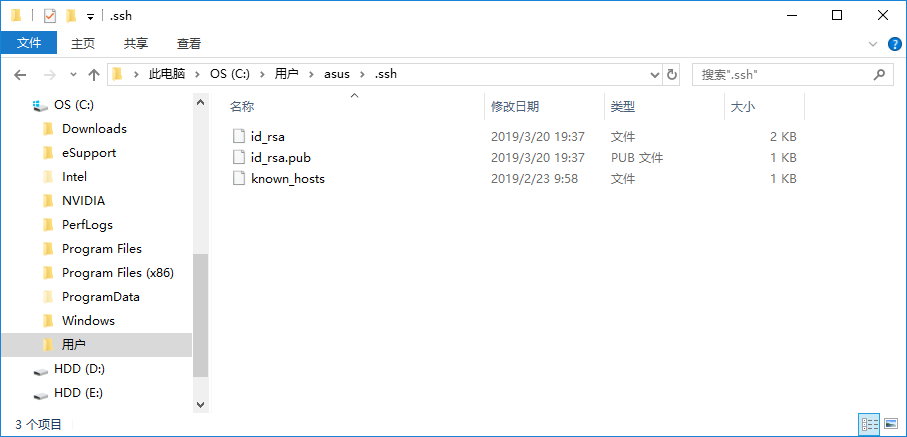

### [ssh-keygen 基本用法](https://www.liaohuqiu.net/cn/posts/ssh-keygen-abc/)

ssh 公钥认证是ssh认证的方式之一。通过公钥认证可实现ssh免密码登陆，git的ssh方式也是通过公钥进行认证的。

在用户目录的home目录下，有一个`.ssh`的目录，和当前用户ssh配置认证相关的文件，几乎都在这个目录下。



`ssh-keygen` 可用来生成ssh公钥认证所需的公钥和私钥文件。

> 使用 `ssh-keygen` 时，请先进入到 `~/.ssh` 目录，不存在的话，请先创建。并且保证 `~/.ssh` 以及所有父目录的权限不能大于 `711`

### 生成的文件名和文件位置

使用 `ssh-kengen` 会在~/.ssh/目录下生成两个文件，不指定文件名和密钥类型的时候，默认生成的两个文件是：

- `id_rsa`
- `id_rsa.pub`

第一个是私钥文件，第二个是公钥文件。

生成ssh key的时候，可以通过 `-f` 选项指定生成文件的文件名，如下:

```
[huqiu@101 .ssh]$ ssh-keygen -f test   -C "test key"
                             ~~文件名   ~~~~ 备注
```

如果没有指定文件名，会询问你输入文件名:

```
[huqiu@101 .ssh]$ ssh-keygen
Generating public/private rsa key pair.
Enter file in which to save the key (/home/huqiu/.ssh/id_rsa):
```

你可以输入你想要的文件名，这里我们输入`test`。

### 密码

之后，会询问你是否需要输入密码。输入密码之后，以后每次都要输入密码。请根据你的安全需要决定是否需要密码，如果不需要，直接回车:

```bash
[huqiu@101 .ssh]$ ssh-keygen -t rsa -f test -C "test key"
Generating public/private rsa key pair.
Enter passphrase (empty for no passphrase):
Enter same passphrase again:
```