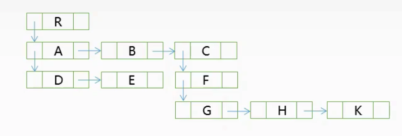

## 线性表

### 顺序表（顺序存储）

- 静态分配
- 动态分配

### 链表（链式存储）

- 单向链表

  ```js
  {
      value: "节点的值",
      next: "指向下一节点"
  }
  ```

- 双向链表

  ```js
  {
      value: "节点的值",
      prev: "指向上一节点",
      next: "指向下一节点"
  }
  ```

- 循环链表

  - 最后一个节点指回头节点
  - 循环单向链表
  - 循环双向链表

- 静态链表

  - 分配一整片连续的内存空间
  - 对象数组
  - `index=0`：头节点
  - `next=-1`：NULL


## 操作受限的线性表

### 1. 栈

- 先进后出
- 栈顶进出
- 逻辑结构与普通线性表相同
- 顺序栈：顺序存储实现的栈
- 链栈：链式存储实现的栈

### 2. 队列

- 先进先出
- 队尾入，队头出

### 3. 双端队列


### 栈的应用

- 括号匹配
- 逆波兰式（后缀表达式）
- 调用栈

### 队列的应用

- 树的层次遍历（~~广度优先遍历~~）

## 串

- 子串：串中任意个**连续的**字符组成的子序列
- 子序列：序列的一部分项按原有次序排列而得的序列，**不要求连续**
- 串是一种特殊的线性表，串的数据元素之间也呈<u>线性关系</u>，但串的数据元素限定为<u>字符集</u>
- 模式匹配：在`主串`中找到与`模式串`相同的**子串**（未必存在）

## 树与二叉树

### 树

> 树是**n**个节点的有限集合（n≥0）
>
> n=0时，称为空树
>
> 任意非空树应满足：
>
> 1. 有且仅有一个特定的，**根结点**
> 2. 当n>1时，其余结点可以分为**m**个互不相交的有限集合（m>0），其中每一个集合本身又是一棵树，称为根节点的**子树**

- 树是一种**逻辑结构**
- 结点的**度**：树中一个结点的<u>孩子个数</u>
- 树的**度**：树中结点的最大**度**数
- 树的**高度**：树中结点的最大层数
- 结点的**高度**：从`叶结点`开始，自底向上，逐层累加
- 结点的**深度**：从`根节点`开始，自顶向下，逐层累加
- 有序树：树中结点的各子树，从左到右是**有次序**的，不能互换；反之为`无序树`
- 路径：两个结点之间的路径 => **结点序列**，自顶向下
- 森林：m棵互不相交的树的集合（m≥0）

### 二叉树

#### 1. 满二叉树

- 高度为 h，含有  2<sup>h</sup>-1 个结点的二叉树
- 所有的叶子结点一定在最后一层
- 编号：从上到下，从左至右


#### 2. 完全二叉树

- 高度为 h，有 n 个结点的二叉树，其每个结点的编号都与高度为 h 的满二叉树中的编号相同
- 叶子结点只可能在最高的两层上出现
- 最高层的叶子结点，都依次排在最左边的位置


#### 3. 二叉排序树

- 若树非空，对任意结点若存在左子树/右子树，则其左子树上的**所有结点**的值均<u>小于</u>该节点，右子树上**所有结点**的值均<u>大于</u>该节点。
- 左子树/右子树也是一棵二叉排序树 *递归定义的结构*


#### 4. 平衡二叉树

- 二叉树上**任意节点**的左子树和右子树的深度之差不超过 1
- 左子树/右子树也是一棵平衡二叉树 *递归定义的结构*

### 二叉树的性质

1. n<sub>0</sub> = n<sub>2</sub> + 1
2. 非空二叉树上，第 k 层上之多有 2<sup>k-1</sup> 个结点（k≥1）

### 二叉树的顺序存储

- 数组下标对应，**补完后**的完全二叉树的「从上到下，从左到右」编号
- 对于结点`i`：左孩子编号`2i`，右孩子编号`2i+1`
- 添加不存在的空节点，数组中用`0`表示


|     index     |  0   |  1   |  2   |  3   |  4   |  5   |  6   |
| :-----------: | :--: | :--: | :--: | :--: | :--: | :--: | :--: |
| 数组（value） |      |  1   |  2   |  3   |  4   |  0   |  5   |

### 二叉树的链式存储

| leftChild | value | rightChild |
| :-------: | :---: | :--------: |
|  左孩子   |  值   |   右孩子   |

### 二叉树的遍历

- 先序遍历：根 左 右
- 中序遍历：左 根 右
- 后序遍历：左 右 根
- 层次遍历：使用`队列`

### 树的存储结构

#### 1. 双亲表示法


#### 2. 孩子表示法


#### 3. 孩子兄弟表示法

左孩子，右兄弟

 

### 二叉树的应用

#### 1. `平衡二叉树`的**插入**思路，用于降低`二叉排序树`的查找效率为 log<sub>2</sub>n
- 先插入，再调整
- 每次调整**最小**的不平衡子树
- LL平衡旋转（右单旋转）
- RR平衡旋转（左单旋转）
- LR平衡旋转（先左后右双旋转）
- RL平衡旋转（先右后左双旋转）

#### 2. 哈弗曼树

## 图

- 多对多的关系
- 线性表、树可以为空，图不能为空
- G = (V,E)
  - Vertex 顶点
  - Edge 边

### 有向图 & 无向图


### 简单图 & 多重图


### 完全图


### 连通图 & 强连通图


### 连通分量 & 强连通分量

- 有向图
  - 极大强连通子图：是<u>有向图</u>的**强连通分量**
- 无向图
  - 极大连通子图：是<u>无向图</u>的`连通分量`，「极大」要求改连通子图包含其**所有**的`边`
  - 极小连通子图：连通子图，且包含的`边`**最少**


### 生成树

- 包含**全部顶点**的一个`极小连通子图`

### 度

- 无向图
  - 顶点的`度`：以<u>该顶点</u>为一个端点的`边`的数目
- 有向图
  - `出度`
  - `入度`

### 路径

- 路径：图中顶点 v 到顶点 w 的**顶点序列**，序列中顶点不重复的路径为**简单路径**
- 路径长度：路径上边的数目
- 回路：第一个顶点和最后一个顶点相同的路径

### 图的存储结构

#### 1. 邻接矩阵

- 顶点集：一维数组
- 边集：二维数组

#### 2. 邻接表

- 顶点表：一维数组，每个元素存放顶点的`value`和<u>边表</u>的`头指针`
- 边表（出边表）：链表，存放：1️⃣与当前结点相邻的边（无向图）；2️⃣从当前结点**出发**的边（有向图）


#### 3. 十字链表

- 针对`有向图`的一种**链式**存储结构
- 保存了一个节点的所有出边集，和所有的入边集
- <u>顶点表</u>结点

  |      value       |               firstIn                |               firstOut               |
  | :--------------: | :----------------------------------: | :----------------------------------: |
  | 顶点相关数据信息 | 指向**以该顶点为弧头**的第一个弧结点 | 指向**以该顶点为弧尾**的第一个弧结点 |

- <u>弧表</u>结点
  弧尾`tail` → 弧头`head`

  |    tailVertex    |    headVertex    |          headLink          |          tailLink          |    Value     |
  | :--------------: | :--------------: | :------------------------: | :------------------------: | :----------: |
  | **弧尾**顶点下标 | **弧头**结点下标 | 指向**弧头相同**的下一条弧 | 指向**弧尾相同**的下一条弧 | 弧的相关信息 |


#### 4. 邻接多重表

- 针对`无向图`的一种**链式**存储结构

- <u>顶点表</u>结点

  |      value       |           firstEdge            |
  | :--------------: | :----------------------------: |
  | 顶点相关数据信息 | 指向第一条**依附于该顶点**的边 |

- <u>边表</u>结点

  |     iVertex      |      iLink       |            jVertex            |             jLink             |
  | :--------------: | :--------------: | :---------------------------: | :---------------------------: |
  | 该边依附顶点下标 | 该边依附顶点下标 | 下一条**依附于 iVertex** 的边 | 下一条**依附于 jVertex** 的边 |


### 图的遍历

- 广度优先搜索（**B**readth-**F**irst-**S**earch）
  - 队列 + 辅助标记数组（访问过的结点）
  - 无权图单源最短路径问题
- 深度优先搜索（**D**epth-**F**irst-**S**earch）
  - 栈 + 辅助标记数组

### 图的应用

#### 1. 最小生成树

- 带权无向连通图 G 的生成树中，**权值之和**最小
- 最小生成树的生成：贪心算法
  - Prim
  - Kruskal

#### 2. 最短路径

- 两个顶点之间带权路径长度最短的路径
- Dijkstra 算法
  - 带权图**单源**最短路径
  - 计算出选取的源点到其余各点的最短路径长度
  - 贪心算法
- Floyd 算法
  - 求**各顶点之间**最短路径

#### 3. 拓扑排序

- 有向无环图 DAG
- AOV网：Activity-On-Vertex，用一个 DAG 图表示一个`工程`，其<u>顶点</u>表示`活动`，用<u>有向边</u> <V<sub>i</sub>,V<sub>j</sub>> 表示活动 V<sub>i</sub> 先于 V<sub>j</sub> 进行的`传递关系`

#### 4. 关键路径

- AOE网：Activity-On-Edge，在有向带权图中，<u>顶点</u>表示`事件`，以<u>有向边</u>表示`活动`
- 活动的开始：只有在某顶点（事件）发生后，从该顶点出发的各有向边（活动）才能开始
- 事件的开始：只有在**进入**某顶点（事件）的**所有**有向边（活动）都结束时，该顶点（事件）才能发生
- 源点：入度为 0，表示工程的开始
- 汇点：出度为 0，表示工程的结束
- 关键路径：从`源点`到`汇点`的**最大路径长度**的路径
- 关键活动：关键路径上的`活动`（顶点）

## 查找

- 查找表：用于查找的数据集合，由同一种数据类型组成
- 关键字
  - 数据元素中**唯一表示**该元素的值
  - 基于关键字查找，查找结果应是唯一的
- 平均查找长度
  - 查找过程中，一次查找的长度是，需要比较关键字的次数
  - 平均查找长度是，所有查找过程中，关键字比较次数的平均值

### 二分查找

- 仅适用于**有序**的顺序表（数组）

### 分块查找

- 索引顺序查找
- 查找表分为若干子块
- 块内元素可以无序，块间有序
- 第 i 块的`最大关键字`，小于第 i+1 块的所有数据元素的关键字
- 索引表：含有<u>各块的最大关键字</u>，和块的第一个元素的**地址**

### B树

- 多路平衡查找树
- 终端结点的子树才是叶子结点
- 一个 *m* 阶的B树是一个有以下属性的树：
  - 每个结点至多有 *m* 棵子树（分支），至多含有 *m-1* 个关键字（格子）
  - 若根结点不是终端结点，则至少有两个子树
  - 除根节点外的所有非叶结点至少有 ⌈*m*/2⌉ 棵子树，至少含有 ⌈*m*/2⌉ -1 个关键字
  - 所有的叶子节点都在同一层，指向这些结点的指针为空
- 查找
- 删除


### B+树


### 哈希表

```js
Address = HashFunc(key)
```

- 哈希函数（常用）
  - 直接定址法
  - 除留余数法
  - 数字分析法
  - 平方取中法
- 处理冲突
  - 开放定址法：发生冲突时，使用其他位置
    - 线性探测法
    - 平方探测法
  - 链地址法

## 排序

### 内部排序

- 插入排序
  - 直接插入排序
  - 折半插入排序
  - 希尔排序
- 交换排序
  - 冒泡排序
  - 快速排序
- 选择排序
  - 简单选择排序
  - 堆排序
- 归并排序
- 基数排序

### 外部排序

- 多路归并排序

