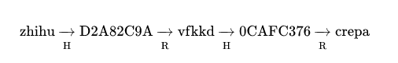
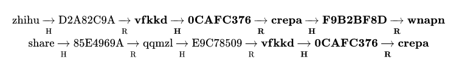

[彩虹表 - 知乎](https://www.zhihu.com/question/19790488/answer/19290308) 

## 哈希链

- 预计算的哈希链集`Precomputed hash chains`
- 破解的哈希函数 H，约简函数 R
- 哈希函数 H 是不可逆的，所以对于`密文`进行 R 运算**几乎不可能**得到`明文`原文
- 约简函数 R 的要求
  - 能将值域限定在固定的范围 *因此可以将 R 理解成一种hash函数*
  - R 必须同哈希函数一样，尽量保证输出值在值域中的均匀分布，减少碰撞的概率

### 构造哈希链

- 对明文进行`H运算`得到密文，对此密文进行`R运算`，得到下一次进行H运算的明文
- 对一个随机的起始明文进行`k`次的“H运算，R运算”后，得到一条哈希链 *如下图*
- 哈希链只需要保存`起节点`（第一个随机明文）和`末节点`，从而节省了存储空间

### 哈希链集

- 大量的随机明文作为起节点，得到多条`哈希链`作为`哈希链集`

- 破解流程：目标密文 C，目标明文 P，哈希链集 S
  - 对`C`进行一次`R运算`，如果运算结果的明文在`S`的任意一末节点上，即可猜测`P`极大可能在此哈希链上
  - 如果不存在这样一条哈希链，则先进行一次`H运算`后，再`R运算`得到新的结果明文进行判断
  - 如此往复，直到尝试了`K`次`R运算`后，所需的`P`并不在`S`里（每一条哈希链都是经过了K次的H，和K次的R，所以K次即为上限）
  - 如果找到这样的一条哈希链，则从其的起节点起，按照构造哈希链的顺序查找，`P`在找到`C`的那一次`H运算`中

## 彩虹表

### 哈希链集的不足之处

- 如果约简函数 R 出现了哈希碰撞，碰撞处往后的链条节点完全相同，造成了冗余
- 为了减小此情况带来的影响，出现了彩虹表

### 彩虹表的改进之处

- 一条运算`K`次的哈希链，将使用`K`个不同的约简函数，R1 ... Rk
- 即便在某一处出现了哈希碰撞，也会因后续使用的 Ri 的不同从而避免了冗余（极大概率）

### 彩虹表的防御

- 加盐`salt`
- 提高单次H运算的计算耗时