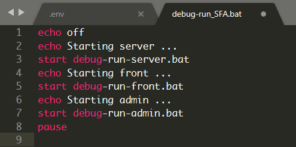
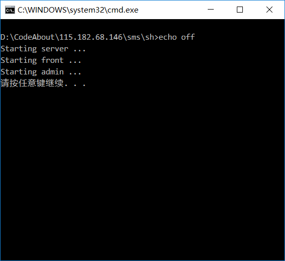

1. [pause暂停命令](https://blog.csdn.net/Turbo_J/article/details/79608967)
2. [批处理命令之Start的详细用法](http://www.cnblogs.com/qlqwjy/p/8445993.html)
3. [@echo off](https://blog.csdn.net/albertsh/article/details/52777987)
4. [start命令 运行多个.bat](https://blog.51cto.com/leomars/1181119)
5. [call命令 运行多个.bat](http://www.dovov.com/bat-bat.html)

