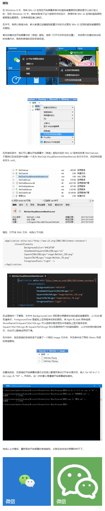

### 1.总结

- 使用Windows Tile Color Changer修改磁片背景色
- 在开始菜单中右键磁片找到快捷菜单的文件夹位置，在其中直接修改快捷方式的图标

### 2.[Windows Tile Color Changer](https://www.thewindowsclub.com/windows-tile-color-changer-download)

[设置磁块颜色](https://www.zhihu.com/question/32083911/answer/72105444)

### 3.[Windows10 深度美化技巧](https://www.zhihu.com/question/39002007/answer/246169780)

