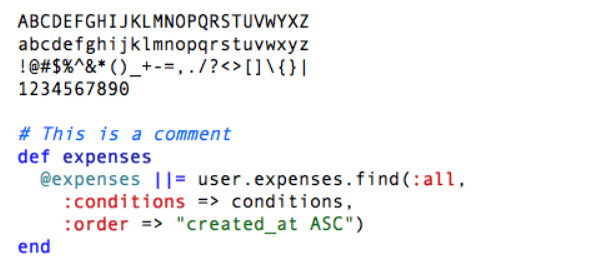
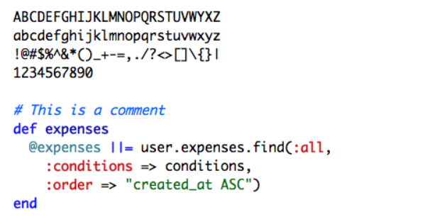
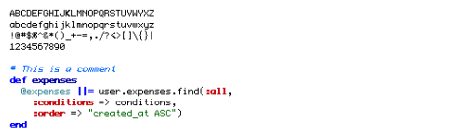
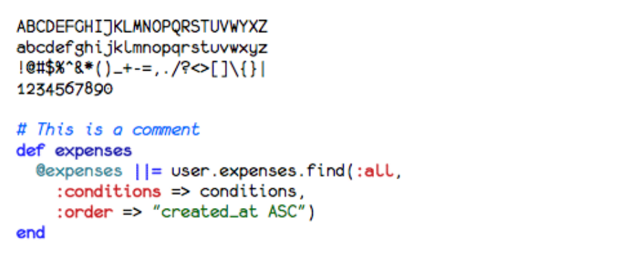
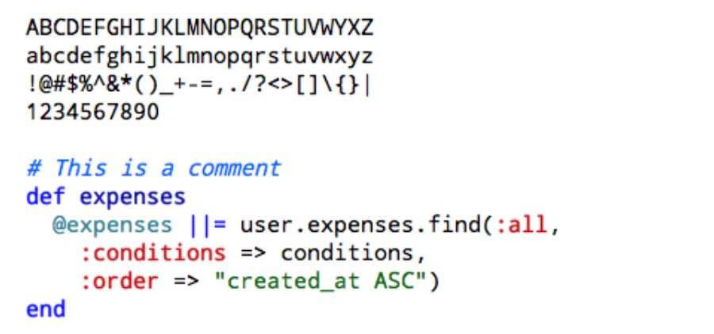
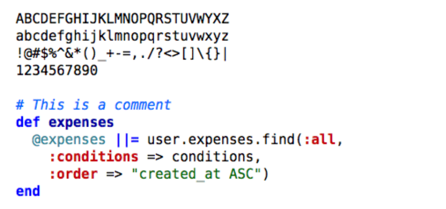
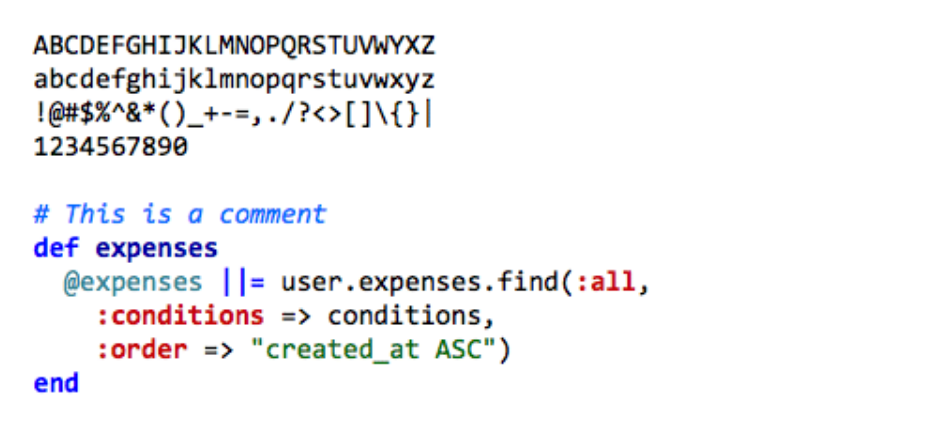
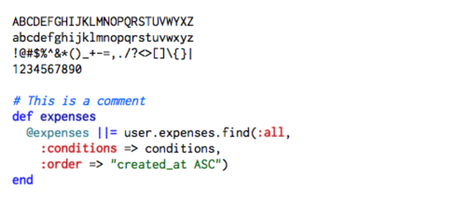

- [原文链接](https://www.iteye.com/news/11102-10-great-programming-font)

- [英文原文](http://hivelogic.com/articles/top-10-programming-fonts)

### 10.Courier

Courier new是Courier的变形，由于可以轻易的对齐字段的左右边界，是编程中最常用的字体，经常被作为默认字体使用。这个字体看上去很死板，在使用这个字体时最好调整一下大小，并开启anti-aliasing(边缘柔化或抗锯齿)。

### 9.Andale Mono

它比Courier系列的字体看上去要舒服一点，由于在很多系统中都表现的非常友好，所以也经常被作为默认字体使用。不过字体间的距离还是让人不太满意

### 8.Monaco

Monaco一直都是Mac上默认的等宽字体，个人认为这个字体在9-10号大小，不使用anti-aliasing 的情况下效果最佳。在Mac上这确实是一个不错的选择，不过还有更好的，所以请继续向下阅读。

### 7.Profont

Profont是一个类似于Monaco的字体，可以在Mac，Windows，Linux下使用，在尺寸较小的情况下效果最佳。

### 6.Monofur

Monofur是一个比较独特的宽字体，在任何尺寸下的效果都很不错。不管是在大尺寸还是小尺寸中，都要开启anti-aliasing效果。

### 5. Proggy

Proggy是一个看上去很干净的等宽字体，很受Windows用户的亲睐，在Mac上的效果也还不错。不过一般在字体尺寸比较小的情况下使用。

### 4. Droid Sans Mono

[Droid ](http://www.ascendercorp.com/pr/2007-11-12/)系列字体是一套不错的字体，尤其是在小屏的手持设备中表现更佳，例如Android，它基于Apache license。

### 3. Deja Vu Sans Mono

[Deja Vu](http://dejavu-fonts.org/wiki/index.php?title=Main_Page)是个人最喜爱的免费的系列字体之一，在任何尺寸下的表现都很好。

### 2. Consolas

[Consolas](http://www.ascenderfonts.com/font/consolas-regular.aspx)是一个商业字体，也就是说它不是免费的，但它与很多微软的产品捆绑在一起。如果它能免费提供，应该会成为此名单上的第一名！

### 1. Inconsolata

[Inconsolata](http://www.levien.com/type/myfonts/inconsolata.html)是个人最喜欢的字体，而且它是免费的。

